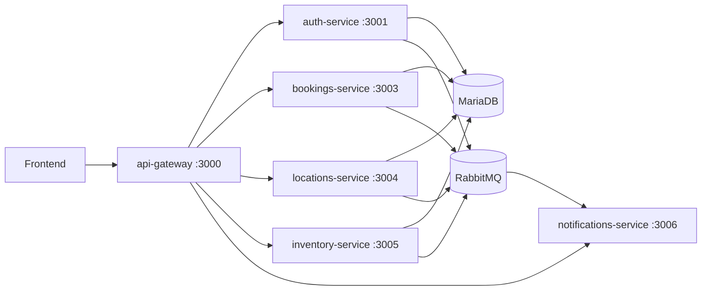

# Backend - Reservas SK

Backend del proyecto construido con Spring Boot y arquitectura de microservicios.

## 1. Stack Tecnologico

### Base
- Java 17
- Spring Boot 3.4.x
- Gradle multi-modulo

### Servicios HTTP/API
- Spring Web
- Spring Cloud Gateway (API Gateway)
- Spring Validation

### Seguridad
- Spring Security
- JWT (`io.jsonwebtoken:jjwt-*`)

### Persistencia y Datos
- MariaDB
- JDBC (bookings, inventory, locations)
- JPA (auth)
- Liquibase (migraciones en `services/database`)

### Integracion y Realtime
- RabbitMQ (`spring-boot-starter-amqp`)
- WebSocket STOMP (`notifications-service` y `bookings-service`)

### Infraestructura local
- Docker / Docker Compose

## 2. Arquitectura General



## 3. Servicios y Responsabilidades

| Servicio | Puerto | Responsabilidad |
| --- | --- | --- |
| `api-gateway` | 3000 | Entrada unica, ruteo HTTP y WS |
| `auth-service` | 3001 | Registro, login, perfil, JWT |
| `bookings-service` | 3003 | Disponibilidad, creacion y cancelacion de reservas |
| `locations-service` | 3004 | Gestion de ciudades y espacios |
| `inventory-service` | 3005 | Gestion de equipos |
| `notifications-service` | 3006 | Broadcast de eventos por WebSocket |

Infraestructura de compose:
- MariaDB: `3307 -> 3306`
- RabbitMQ broker: `5672`
- RabbitMQ management: `15672`
- Liquibase: contenedor `database` (ejecuta migraciones al iniciar)

## 4. Ruteo en API Gateway

Configurado en `services/api-gateway`:
- `GET /health` (health del gateway)
- ` /auth/**` -> `auth-service`
- ` /bookings/**` -> `bookings-service`
- ` /inventory/**` -> `inventory-service`
- ` /locations/**` -> `locations-service`
- ` /notifications/**` -> `notifications-service`
- WebSocket ` /notifications/ws` y ` /notifications/ws/**` -> `notifications-service` (upgrade websocket)

Nota:
- El endpoint WS de reservas (`/bookings/ws`) vive en `bookings-service` y normalmente se consume directo a ese servicio.

## 5. Endpoints REST por Servicio

### 5.1 auth-service

Base path: `/auth`

| Metodo | Ruta | Auth | Descripcion |
| --- | --- | --- | --- |
| `POST` | `/auth/register` | No | Registro de usuario |
| `POST` | `/auth/login` | No | Login y emision de JWT |
| `GET` | `/auth/me` | Si | Perfil del usuario autenticado |
| `GET` | `/health` | No | Health check |

### 5.2 bookings-service

Base path: `/bookings`

| Metodo | Ruta | Auth | Descripcion |
| --- | --- | --- | --- |
| `GET` | `/bookings/spaces/{spaceId}/availability` | Si | Consulta disponibilidad por rango |
| `POST` | `/bookings/reservations` | Si | Crea reserva |
| `GET` | `/bookings/reservations` | Si | Lista reservas (filtros opcionales) |
| `GET` | `/bookings/reservations/{id}` | Si | Obtiene reserva por id |
| `PATCH` | `/bookings/reservations/{id}/cancel` | Si | Cancela reserva |
| `GET` | `/health` | No | Health check |

### 5.3 locations-service

Base path: `/locations`

| Metodo | Ruta | Auth | Descripcion |
| --- | --- | --- | --- |
| `POST` | `/locations/cities` | Si | Crea ciudad |
| `GET` | `/locations/cities` | Si | Lista ciudades |
| `GET` | `/locations/cities/{id}` | Si | Ciudad por id |
| `PUT` | `/locations/cities/{id}` | Si | Actualiza ciudad |
| `DELETE` | `/locations/cities/{id}` | Si | Elimina ciudad |
| `POST` | `/locations/spaces` | Si | Crea espacio |
| `GET` | `/locations/spaces` | Si | Lista espacios |
| `GET` | `/locations/spaces/{id}` | Si | Espacio por id |
| `PUT` | `/locations/spaces/{id}` | Si | Actualiza espacio |
| `DELETE` | `/locations/spaces/{id}` | Si | Elimina espacio |
| `GET` | `/health` | No | Health check |

### 5.4 inventory-service

Base path: `/inventory/equipments`

| Metodo | Ruta | Auth | Descripcion |
| --- | --- | --- | --- |
| `POST` | `/inventory/equipments` | Si | Crea equipo |
| `GET` | `/inventory/equipments` | Si | Lista equipos |
| `GET` | `/inventory/equipments/{id}` | Si | Equipo por id |
| `PUT` | `/inventory/equipments/{id}` | Si | Actualiza equipo |
| `DELETE` | `/inventory/equipments/{id}` | Si | Elimina equipo |
| `GET` | `/health` | No | Health check |

### 5.5 notifications-service

| Metodo | Ruta | Auth | Descripcion |
| --- | --- | --- | --- |
| `GET` | `/notifications/health` | No | Health check |

## 6. WebSocket y Realtime

### 6.1 notifications-service (event bus realtime)

- Endpoint STOMP: `/notifications/ws`
- Topics publicados:
  - `/topic/events`
  - `/topic/events.{channel}`
  - `/topic/events.{routingKey}`

Se alimenta de eventos RabbitMQ y los retransmite a clientes WebSocket.

### 6.2 bookings-service (realtime de reservas)

- Endpoint STOMP: `/bookings/ws`
- Topics publicados:
  - `/topic/bookings.reservations`
  - `/topic/bookings.reservations.created`
  - `/topic/bookings.reservations.cancelled`

Uso:
- cuando se crea/cancela una reserva, se emite evento para refresco en pestanas concurrentes.

## 7. Mensajeria (RabbitMQ)

Exchange principal:
- `reservas.events`

Routing keys usadas en el dominio:
- `auth.user.created`
- `bookings.reservation.created`
- `bookings.reservation.cancelled`
- `inventory.equipment.created`
- `inventory.equipment.updated`
- `inventory.equipment.deleted`
- `locations.city.created`
- `locations.city.updated`
- `locations.city.deleted`
- `locations.space.created`
- `locations.space.updated`
- `locations.space.deleted`

`notifications-service` consume estas claves y hace broadcast por STOMP.

## 8. Seguridad y Manejo de Errores

### Seguridad
- Autenticacion por JWT Bearer en servicios de negocio.
- Endpoints de health abiertos.
- En `auth-service`, `/auth/register` y `/auth/login` son publicos.

### Errores
- Respuesta estandar en servicios:
  - `ok`
  - `data`
  - `message`
  - `errorCode`
- `GlobalExceptionHandler` en cada servicio para mapear errores de negocio y validacion a HTTP consistente.

## 9. Estructura de Carpetas

```text
Backend/
  services/
    api-gateway/
    auth-service/
    bookings-service/
    inventory-service/
    locations-service/
    notifications-service/
    database/
  docker-compose.yml
  docker-compose.app.yml
  settings.gradle
```

## 10. Ejecucion

### Opcion A - Stack completo (recomendado)

Desde `Backend/`:

```bash
docker compose up --build
```

### Opcion B - Solo aplicaciones contra infraestructura externa

```bash
docker compose -f docker-compose.app.yml up --build
```

## 11. Variables de Entorno Clave

Comunes:
- `DB_HOST`, `DB_PORT`, `DB_USER`, `DB_PASSWORD`, `DB_NAME`
- `JWT_SECRET`
- `RABBITMQ_ENABLED`
- `RABBITMQ_HOST`, `RABBITMQ_PORT`, `RABBITMQ_USER`, `RABBITMQ_PASSWORD`
- `RABBITMQ_EXCHANGE`
- `WEBSOCKET_ALLOWED_ORIGINS`

Gateway:
- `AUTH_URL`, `BOOKINGS_URL`, `INVENTORY_URL`, `LOCATIONS_URL`, `NOTIFICATIONS_URL`, `NOTIFICATIONS_WS_URL`

## 12. Notas de Mantenimiento

- Si agregas endpoints nuevos, actualiza la seccion de rutas y el gateway.
- Si agregas eventos nuevos, documenta routing key y payload.
- Mantener `errorCode` en errores de negocio para no romper integracion frontend.


