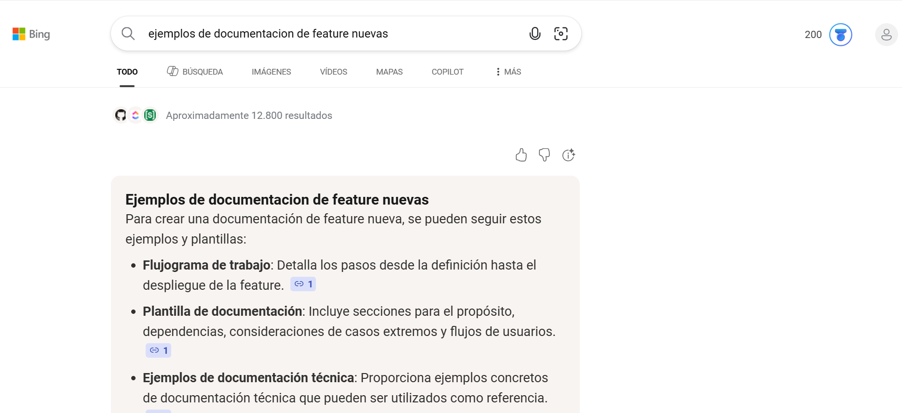

Feature verificar asistencia por QR
Fuentes/consultas:
1. Consulta "Ejemplos de documentación de Feature nuevas"

2. Como construir diagramas de flujo 
"https://www.paginaspersonales.unam.mx/app/webroot/files/1613/Asignaturas/1818/Archivo1.5032.pdf"
Se realiza en mermaid con el diagrama de flujo del software integrando la feature de verificar asistencia por QR.
3.
- Historias de usuario INVEST "https://www.scrummanager.com/blog/2024/10/el-metodo-invest-y-las-historias-de-usuario/" 
- criterios de aceptación "https://www.scrummanager.com/blog/2023/03/criterios-de-aceptacion-definicion-y-ejemplos/"
- Estimación de historias de usuario "https://fastercapital.com/es/contenido/Estimacion-agil--como-estimar-tus-historias-de-usuario-y-sprints.html"
