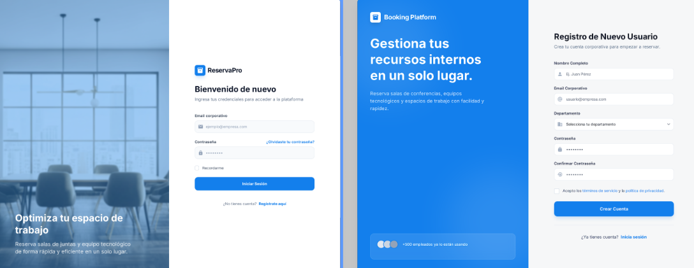
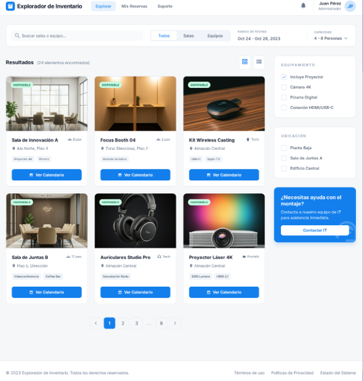
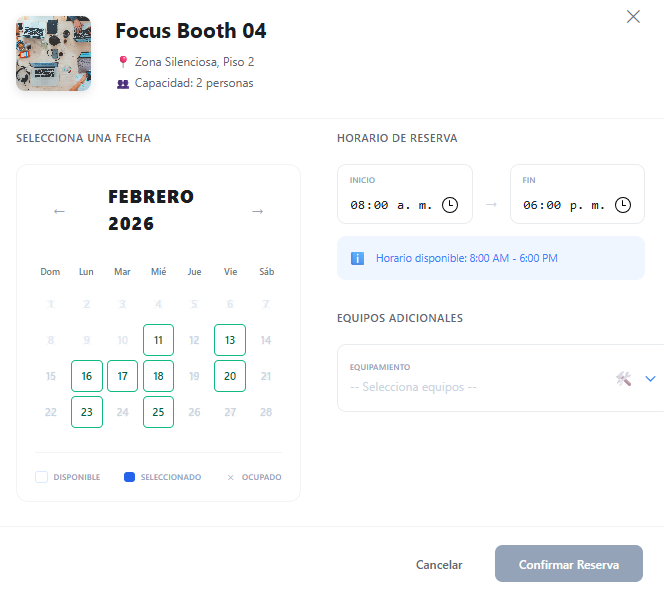

# AI_WORKFLOW.md

En este documento se detallan las instrucciones para el uso del AI en el proyecto de reservas de habitaciones.

## Instrucciones

1. Ya que el proyecto va ser "pequeño" se implementara una estructura de carpetas simple y ordenada por features, lo cual se le asigna un rol a la IA que asuma el rol de un desarrollador senior experto en React especialista en arquitectura basada en Component-View, lo cual debe seguir las mejores prácticas de desarrollo.

2. Con el rol asignado se le pide que cree la estructura de carpetas y se verifica que lo creado sea correcto con la arquitectura propuesta.

3. Mediante Google Stitch me apoye para la creacion de una UI para el login y signup que cumpla con los requisitos del proyecto.

4. Ya con el Mockup realizado de login/signup se le pide a la IA que implemente dicho mockup siguiendo la arquitectura propuesta.
    4.1 La IA divagar en la estructuracion del mockup ya que crea otra estructura de carpetas que no cumple con la arquitectura propuesta.
    4.2 Se le pide a la IA que verifique la arquitectura propuesta y que siga la misma en la implementacion del mockup.
    4.3 La IA no realiza aplica un diseño responsive y se le solicita que lo implemente.
5. Se verifica que la implementacion sea correcta con la arquitectura propuesta.
6. Nuevamente desde Google stitch creo el mockup del dashboard de reservas.

7. Le comparto dicho mockup de dashboard y le pido que implemente dicho mockup siguiendo la arquitectura propuesta.
8. Se verifica que la implementacion sea correcta con la arquitectura propuesta y esta vez cumple con la arquitectura asignado y esperado, solo con un prompt.
9. Mediante Google stitch genero un modal para la asignacion de reservas.
10. Dicho mockup del modal se lo comparto a la IA para que implemente dicho modal siguiendo la arquitectura propuesta.
11. En la implementacion del modal la IA falla en el diseño de la ui del calendario, se corrigue solo con un prompt.

12. Se verifica la implementacón y cumple con lo asignado.
13. Mediante Google stitch genero el mockup de la page de la las reservas asignadas y ya que divaga en el diseño tomo solo la seccion que requiero.
14. Comparto dicha seccion y solicito que cree la estructura de carpetas siguiendo con los mismo estilos.[pageReseervations](image-5.png)
15. La estructura generada no cumplio con lo requerido ya que ocultaba el header, para corregir dicho issue se soluciona con 2 prompts mas.
16. Mediaante un prompt se crea el componente de paginación y su respectiva logica, en este caso se cumplio con lo asignado.
17. Se le pide a la IA que haga uso de los assets (logos) para que sea consumido en el header.
