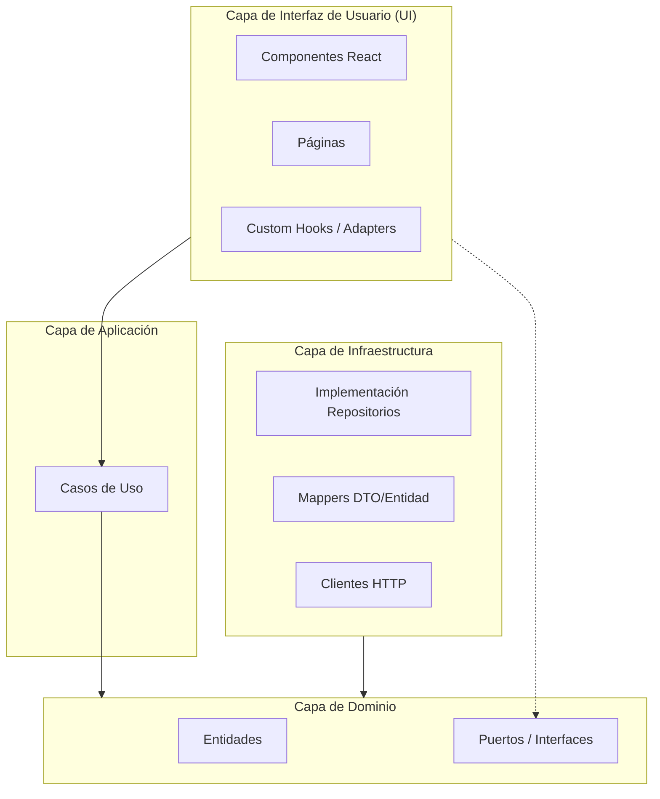

# Arquitectura Hexagonal - Frontend Reservas Sofka

Este documento describe la arquitectura actual del frontend, la cual sigue el patrón de **Arquitectura Hexagonal (Puertos y Adaptadores)** para garantizar un desacoplamiento total entre la lógica de negocio y la infraestructura (frameworks, librerías externas, APIs).

## 🏗️ Diagrama de Arquitectura



## 📁 Estructura de Carpetas Actual

```
src/
├── core/                                    # LÓGICA DE DOMINIO Y PUERTOS
│   ├── domain/                              # Capa de Dominio
│   │   ├── entities/                        # Entidades de negocio (User, Reservation, etc.)
│   │   ├── value-objects/                   # Objetos de valor
│   │   └── errors/                          # Errores de dominio personalizados
│   │
│   ├── ports/                               # Puertos (Interfaces de entrada/salida)
│   │   ├── repositories/                    # Interfaces de repositorios (IAuthRepository, etc.)
│   │   └── services/                        # Interfaces de servicios (IHttpClient, IStorageService)
│   │
│   └── adapters/                            # Adaptadores de Entrada (React Hooks)
│       ├── hooks/                           # Hooks que orquestan Casos de Uso
│       ├── providers/                       # Context Providers (DependencyProvider)
│       └── di/                              # Inyección de Dependencias (Container)
│
├── application/                             # CAPA DE APLICACIÓN (Casos de Uso)
│   └── use-cases/                           # Implementación de lógica de aplicación
│       ├── auth/                            # Casos de uso de autenticación
│       ├── dashboard/                       # Casos de uso de gestión de inventario/ubicaciones
│       └── reservations/                    # Casos de uso de reservas
│
├── infrastructure/                          # CAPA DE INFRAESTRUCTURA (Adaptadores de Salida)
│   ├── http/                                # Implementación de clientes HTTP (Axios)
│   ├── repositories/                        # Implementación de repositorios (HTTP Repos)
│   ├── storage/                             # Persistencia local (LocalStorage)
│   └── mappers/                             # Transformación de datos (DTO ↔ Entity)
│
└── ui/                                      # CAPA DE PRESENTACIÓN
    ├── components/                          # Componentes atómicos y moleculares
    ├── layouts/                             # Plantillas de diseño base
    ├── pages/                               # Componentes de página (Rutas)
    └── styles/                              # Configuración global de estilos
```

## ✅ Estado de la Implementación

### 1. Capa de Dominio (Core)
- **Entidades**: `User`, `Reservation`, `Location`, `InventoryItem` implementadas con validaciones propias.
- **Puertos**: Definidos contratos estables para todos los repositorios y servicios externos.

### 2. Capa de Aplicación
- **Casos de Uso**: Implementada la lógica de orquestación para:
  - Autenticación (Login, Register, Logout, GetCurrentUser).
  - Reservas (Create, Cancel, GetUserReservations).
  - Dashboard (GetLocations, GetInventory, Assign/Remove Inventory).

### 3. Capa de Infraestructura
- **Adaptadores**: Implementados usando patrones robustos:
  - **Patrón Adapter**: `AxiosHttpClient` y `LocalStorageService`.
  - **Patrón Factory**: `HttpClientFactory` para configurar clientes con diferentes URLs y middlewares.
  - **Mappers**: Transformación centralizada de respuestas de API a entidades de dominio.

### 4. Capa de UI
- **Inyección de Dependencias**: 
  - `container.js`: Singleton que mantiene el registro de todas las instancias.
  - `DependencyProvider.jsx`: Facade que expone las dependencias a React evitando el "prop drilling".
- **Componentes**: Migrados totalmente a la nueva estructura en `src/ui`.

## 📊 Patrones de Diseño Aplicados

| Patrón | Implementación | Propósito |
|--------|---------|-----------|
| **Port (Interface)** | `IAuthRepository`, `IHttpClient` | Define contratos sin acoplarse a implementaciones. |
| **Adapter (Output)** | `HttpAuthRepository`, `AxiosHttpClient` | Adapta servicios externos al dominio. |
| **Adapter (Input)** | `useUserReservations`, `useLogin` | Adapta los casos de uso para que sean usados por React. |
| **Factory** | `HttpClientFactory` | Centraliza la creación y configuración de clientes HTTP. |
| **Singleton** | `container.js` | Asegura una única instancia del contenedor de dependencias. |
| **Facade** | `useDependencies` | Provee una API limpia y simplificada para los componentes UI. |
| **Mapper** | `UserMapper`, `ReservationMapper` | Desacopla el modelo de datos de la API del modelo de dominio. |

## 🚀 Ventajas de esta Arquitectura

1. **Testabilidad**: Es posible probar casos de uso y entidades de manera aislada con mocks de los puertos.
2. **Independencia de Framework**: React es tratado como un detalle de implementación en la capa `ui/`.
3. **Mantenibilidad**: Los cambios en la API afectan solo a los mappers y repositorios en `infrastructure/`.
4. **Claridad**: La separación de responsabilidades facilita la navegación y el escalado del proyecto.

## 🔍 Verificación

Para asegurar la integridad de la arquitectura:
- Los componentes UI **solo** pueden usar hooks de `core/adapters/hooks`.
- Los casos de uso **solo** pueden depender de puertos (`core/ports`).
- Las entidades de dominio **no** deben tener dependencias externas.
- Toda transformación de datos externa debe ocurrir en `infrastructure/mappers`.
