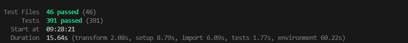

# Estrategia de Testing — Frontend Reservas Sofka

> **Última actualización:** 27 de febrero de 2026

## 1. Visión General

Este documento define la estrategia de QA del proyecto Frontend, diferenciando claramente entre pruebas de **verificación** (¿estamos construyendo el producto correctamente?) y pruebas de **validación** (¿estamos construyendo el producto correcto?).

| Concepto      | Pregunta clave                                    | Enfoque                                     |
|---------------|---------------------------------------------------|----------------------------------------------|
| Verificación  | ¿El código cumple con la especificación técnica?  | Lógica interna, contratos, estructura        |
| Validación    | ¿El producto cumple las necesidades del usuario?  | Comportamiento visible, flujos, experiencia  |

---

## 2. Estado Actual — Evidencia de Tests

### Resultado de ejecución



```
 Test Files   46 passed (46)
      Tests   391 passed (391)
   Start at   09:28:21
   Duration   15.64s (transform 2.08s, setup 8.79s, import 6.09s, tests 1.77s, environment 60.22s)
```

### Cobertura de código

| Métrica      | Porcentaje | Cubierto / Total |
|--------------|:----------:|:-----------------:|
| Statements   | **40.72%** | 562 / 1380        |
| Branches     | **42.14%** | 365 / 866         |
| Functions    | **47.15%** | 166 / 352         |
| Lines        | **42.15%** | 505 / 1198        |

> Thresholds configurados: **40%** mínimo en todas las métricas (statements, branches, functions, lines).  
> Todas las métricas superan el umbral mínimo. ✅

---

## 3. Comandos de Ejecución de Tests

### Ejecución básica

```bash
# Ejecutar todos los tests en modo watch (desarrollo)
npm test

# Ejecutar todos los tests una sola vez
npm run test:run

# Equivalente con npx
npx vitest run
```

### Ejecución con reportes

```bash
# Generar reportes (default + JUnit XML + JSON + HTML)
npm run test:report

# Los reportes se generan en:
#   ./reports/junit-report.xml    (JUnit XML para CI/CD)
#   ./reports/test-results.json   (JSON estructurado)
#   ./reports/html/               (HTML interactivo)
```

### Ejecución con cobertura

```bash
# Ejecutar tests con reporte de cobertura
npm run test:coverage

# Los reportes de cobertura se generan en:
#   ./reports/coverage/           (HTML, JSON-summary, LCOV)
```

### Ejecución para CI/CD

```bash
# Tests + cobertura + reportes (JUnit + JSON para pipelines)
npm run test:ci
```

### Ejecución selectiva

```bash
# Ejecutar un archivo de test específico
npx vitest run src/core/domain/entities/Reservation.test.ts

# Ejecutar tests que coincidan con un patrón
npx vitest run --reporter=verbose HttpDeliveryRepository

# Ejecutar tests de un directorio específico
npx vitest run src/infrastructure/mappers/

# Ejecutar tests de integración
npx vitest run src/test/integration/

# Ejecutar tests en modo verbose (ver cada test individual)
npx vitest run --reporter=verbose
```

### Verificación de tipos

```bash
# Verificar que las interfaces/ports se cumplen (sin emitir archivos)
npm run type-check
```

---

## 4. Stack de Testing

| Herramienta               | Rol                                    |
|----------------------------|----------------------------------------|
| **Vitest 4.0.18**          | Test runner y framework de assertions  |
| **@testing-library/react 16.3.2** | Renderizado de componentes en jsdom |
| **@testing-library/jest-dom 6.9.1** | Matchers extendidos para DOM     |
| **vi (vitest)**            | Mocks, spies, fake timers              |
| **@vitest/coverage-v8**    | Proveedor de cobertura con V8          |
| **jsdom**                  | Entorno de navegador simulado          |
| **MemoryRouter**           | Simulación de enrutamiento en tests    |

**Configuración:** `vite.config.js` — `environment: 'jsdom'`, `globals: true`, setup en `src/test/setup.js`.

**Reporters configurados:**
- `default` — Salida de consola estándar
- `junit` → `./reports/junit-report.xml`
- `json` → `./reports/test-results.json`
- `html` → `./reports/html/`

**Coverage reporters:** `text`, `text-summary`, `html`, `json-summary`, `lcov` → `./reports/coverage/`

---

## 5. Pirámide de Tests

```
          ╱   ╲
         ╱ E2E ╲             ← (Pendiente) Cypress/Playwright
        ╱───────╲
       ╱ Integra-╲           ← Flujos completos (15 tests)
      ╱  ción     ╲
     ╱─────────────╲
    ╱   Unitarios   ╲       ← Domain + UseCases + Mappers + Repos + UI (376 tests)
   ╱─────────────────╲
```

**Distribución actual: 391 tests en 46 archivos**

| Nivel                              | Archivos | Tests | % del total |
|------------------------------------|:--------:|:-----:|:-----------:|
| Unitario — Entidades de dominio    | 6        | 92    | 23.5%       |
| Unitario — Errores de dominio      | 1        | 15    | 3.8%        |
| Unitario — Casos de uso            | 11       | 52    | 13.3%       |
| Unitario — Mappers                 | 5        | 75    | 19.2%       |
| Unitario — Repositorios HTTP       | 5        | 51    | 13.0%       |
| Unitario — Storage                 | 1        | 18    | 4.6%        |
| Unitario — Componentes UI          | 7        | 43    | 11.0%       |
| Unitario — Páginas                 | 2        | 8     | 2.0%        |
| Validación — Routing               | 1        | 8     | 2.0%        |
| Validación — Hooks                 | 2        | 12    | 3.1%        |
| Integración — Flujos E2E simulados | 3        | 15    | 3.8%        |
| **Total**                          | **46**   | **391** | **100%**  |

---

## 6. Pruebas de VERIFICACIÓN

> _"¿Estamos construyendo el producto correctamente?"_
>
> Verifican que el código cumple las especificaciones técnicas, los contratos entre capas y la lógica de negocio pura.

### 6.1 Entidades de Dominio (Capa Domain) — 92 tests

Verifican la lógica de negocio pura sin dependencias externas.

| Archivo de Test | Entidad | Tests | Qué se verifica |
|-----------------|---------|:-----:|-----------------|
| `Reservation.test.ts` | `Reservation` | 8 | `getRemainingMinutes()`, `isAboutToExpire(threshold)`, manejo de estados, umbral por defecto |
| `Reservation.core.test.ts` | `Reservation` (core) | 29 | `getDurationHours()`, constructores, propiedades derivadas, edge cases temporales |
| `Delivery.test.ts` | `Delivery` | 11 | Construcción, `hasNotes()`, `isValid()`, `toJSON()`, `fromJSON()` |
| `User.test.ts` | `User` | 15 | Propiedades, roles, validación de email, serialización |
| `Location.test.ts` | `Location` | 14 | Capacidad, disponibilidad, propiedades de ubicación |
| `InventoryItem.test.ts` | `InventoryItem` | 15 | Estado, asignación, cantidad, validación de propiedades |

### 6.2 Errores de Dominio — 15 tests

| Archivo de Test | Clase | Tests | Qué se verifica |
|-----------------|-------|:-----:|-----------------|
| `AuthenticationError.test.ts` | `AuthenticationError` y subclases | 15 | Jerarquía de errores (5 subclases), mensajes, herencia, `instanceof` |

### 6.3 Casos de Uso (Capa Application) — 52 tests

Verifican la orquestación de la lógica: validación de precondiciones y delegación al repositorio.

| Archivo de Test | Use Case | Tests | Qué se verifica |
|-----------------|----------|:-----:|-----------------|
| `LoginUseCase.test.ts` | `LoginUseCase` | 5 | Autenticación exitosa, validación de email/password vacíos, propagación de errores |
| `RegisterUseCase.test.ts` | `RegisterUseCase` | 8 | Registro exitoso, validación de campos, longitud mínima de password |
| `LogoutUseCase.test.ts` | `LogoutUseCase` | 3 | Logout invoca repositorio, limpieza de sesión |
| `GetCurrentUserUseCase.test.ts` | `GetCurrentUserUseCase` | 2 | Obtener usuario actual autenticado |
| `SubmitDeliveryUseCase.test.ts` | `SubmitDeliveryUseCase` | 5 | Envío exitoso, validación de campos obligatorios, propagación de errores |
| `CreateReservationUseCase.test.ts` | `CreateReservationUseCase` | 8 | Creación exitosa, validación de fechas, disponibilidad |
| `CancelReservationUseCase.test.ts` | `CancelReservationUseCase` | 2 | Cancelación exitosa, propagación de errores |
| `GetUserReservationsUseCase.test.ts` | `GetUserReservationsUseCase` | 2 | Listado de reservas del usuario |
| `GetLocationsUseCase.test.ts` | `GetLocationsUseCase` | 4 | Obtener ubicaciones, filtrado |
| `GetInventoryUseCase.test.ts` | `GetInventoryUseCase` | 3 | Obtener inventario por ubicación |
| `GetSpaceAvailabilityUseCase.test.ts` | `GetSpaceAvailabilityUseCase` | 4 | Consulta de disponibilidad |
| `AssignInventoryUseCase.test.ts` | `AssignInventoryUseCase` | 5 | Asignación exitosa, validación |
| `RemoveInventoryUseCase.test.ts` | `RemoveInventoryUseCase` | 3 | Remoción de inventario |

### 6.4 Mappers (Capa Infrastructure) — 75 tests

Verifican la transformación fiel entre DTOs del API y entidades de dominio.

| Archivo de Test | Mapper | Tests | Qué se verifica |
|-----------------|--------|:-----:|-----------------|
| `DeliveryMapper.test.ts` | `DeliveryMapper` | 6 | `toDomain()` camelCase/snake_case, null safety, `toApi()`, `toDomainList()` |
| `UserMapper.test.ts` | `UserMapper` | 12 | Mapeo bidireccional, aliases de API, null handling |
| `LocationMapper.test.ts` | `LocationMapper` | 13 | Mapeo de ubicaciones, propiedades opcionales |
| `InventoryMapper.test.ts` | `InventoryMapper` | 15 | Mapeo de inventario, listas, null safety |
| `ReservationMapper.test.ts` | `ReservationMapper` | 29 | Mapeo complejo con fechas, estados, aliases camelCase/snake_case |

### 6.5 Repositorios HTTP (Capa Infrastructure) — 51 tests

Verifican la comunicación HTTP con el backend y el manejo de respuestas/errores.

| Archivo de Test | Repositorio | Tests | Qué se verifica |
|-----------------|-------------|:-----:|-----------------|
| `HttpAuthRepository.test.ts` | `HttpAuthRepository` | 17 | Login, registro, logout, getCurrentUser, manejo de tokens, errores de red |
| `HttpDeliveryRepository.test.ts` | `HttpDeliveryRepository` | 5 | Submit con formato wrapper y directo, errores `ok: false`, errores de red, mapping null |
| `HttpInventoryRepository.test.ts` | `HttpInventoryRepository` | 8 | Obtener, asignar, remover inventario, errores |
| `HttpLocationRepository.test.ts` | `HttpLocationRepository` | 9 | Listar ubicaciones, filtros, manejo de errores |
| `HttpReservationRepository.test.ts` | `HttpReservationRepository` | 12 | CRUD de reservas, disponibilidad, cancelación, errores |

### 6.6 Storage Service — 18 tests

| Archivo de Test | Servicio | Tests | Qué se verifica |
|-----------------|----------|:-----:|-----------------|
| `LocalStorageService.test.ts` | `LocalStorageService` | 18 | `getItem`, `setItem`, `removeItem`, `clear`, serialización JSON, manejo de errores de localStorage |

### 6.7 Contratos de Puerto (Verificación Implícita)

Los ports/interfaces en TypeScript se verifican en tiempo de compilación:
- `IDeliveryRepository.ts` — contrato `submit(): Promise<Delivery>`
- `IReservationRepository.ts` — contrato `create()`, `getByUserId()`, `cancel()`, `getAvailability()`
- `IAuthRepository.ts` — contrato `login()`, `register()`, `logout()`, `getCurrentUser()`
- `ILocationRepository.ts` — contrato `getAll()`, `getById()`
- `IInventoryRepository.ts` — contrato `getByLocation()`, `assign()`, `remove()`

Se verifica vía `tsc --noEmit` (script `type-check`) que las implementaciones cumplen los contratos.

---

## 7. Pruebas de VALIDACIÓN

> _"¿Estamos construyendo el producto correcto?"_
>
> Validan que el usuario ve y experimenta lo que se espera: textos, flujos de navegación, estados de la UI, retroalimentación visual.

### 7.1 Componentes UI — Formularios (16 tests)

| Archivo de Test | Componente | Tests | Qué se valida |
|-----------------|------------|:-----:|---------------|
| `LoginForm.test.jsx` | `LoginForm` | 8 | Inputs email/password, submit, loading, error visible |
| `SignupForm.test.jsx` | `SignupForm` | 8 | Campos de registro, checkbox términos, loading, errores |

### 7.2 Componentes UI — Interacción (24 tests)

| Archivo de Test | Componente | Tests | Qué se valida |
|-----------------|------------|:-----:|---------------|
| `Pagination.test.jsx` | `Pagination` | 10 | Navegación, botones habilitados/deshabilitados, clase active |
| `SearchBar.test.jsx` | `SearchBar` | 4 | Placeholder, query actual, notificación de cambios |
| `ReservationFilterBar.test.jsx` | `ReservationFilterBar` | 6 | Tabs (Próximas/Pasadas/Canceladas), tab activo, búsqueda |
| `ReservationList.test.jsx` | `ReservationList` | 4 | Estado vacío, tarjetas de reserva, nombres de ubicación |

### 7.3 Páginas (8 tests)

| Archivo de Test | Página | Tests | Qué se valida |
|-----------------|--------|:-----:|---------------|
| `LoginPage.test.jsx` | `LoginPage` | 4 | Bienvenida, formulario, branding, subtítulo |
| `SignupPage.test.jsx` | `SignupPage` | 4 | Onboarding, formulario, branding, subtítulo |

### 7.4 Routing y Guards de Acceso (11 tests)

| Archivo de Test | Funcionalidad | Tests | Qué se valida |
|-----------------|---------------|:-----:|---------------|
| `AppRouter.test.jsx` | Enrutamiento | 8 | Rutas públicas/protegidas, redirecciones, layout |
| `ProtectedRoute.test.jsx` | Auth Guard | 3 | Sin token → redirect, con token → renderiza children |

### 7.5 Hooks — Comportamiento Reactivo (12 tests)

| Archivo de Test | Hook | Tests | Qué se valida |
|-----------------|------|:-----:|---------------|
| `useReservationAlert.test.ts` | `useReservationAlert` | 7 | Alertas de expiración, dismiss, umbral personalizable, actualización periódica |
| `useDelivery.test.ts` | `useDelivery` | 5 | Estado inicial, envío exitoso, errores, loading, reset |

---

## 8. Tests de Integración (15 tests)

Validan flujos completos simulados que atraviesan múltiples capas de la arquitectura.

| Archivo de Test | Flujo | Tests | Qué se valida |
|-----------------|-------|:-----:|---------------|
| `auth-flow.integration.test.ts` | Autenticación | 5 | Login → obtener usuario → logout (flujo completo) |
| `dashboard-flow.integration.test.ts` | Dashboard | 6 | Cargar ubicaciones → inventario → disponibilidad → crear reserva |
| `reservation-flow.integration.test.ts` | Reservas | 4 | Listar reservas → cancelar → verificar estado |

---

## 9. Matriz Verificación vs Validación

| Capa Arquitectónica         | Verificación   | Validación   | Tests |
|-----------------------------|:--------------:|:------------:|:-----:|
| **Domain Entities**         | ✅ 92 tests    | —            | 92    |
| **Domain Errors**           | ✅ 15 tests    | —            | 15    |
| **Use Cases**               | ✅ 52 tests    | —            | 52    |
| **Mappers**                 | ✅ 75 tests    | —            | 75    |
| **Repositories HTTP**       | ✅ 51 tests    | —            | 51    |
| **Storage Service**         | ✅ 18 tests    | —            | 18    |
| **Ports (TypeScript)**      | ✅ compile-time | —           | —     |
| **Components UI**           | —              | ✅ 43 tests  | 43    |
| **Pages**                   | —              | ✅ 8 tests   | 8     |
| **Routing**                 | —              | ✅ 11 tests  | 11    |
| **Hooks (state/alert)**     | ✅ parcial     | ✅ parcial   | 12    |
| **Integration flows**       | —              | ✅ 15 tests  | 15    |
| **Total**                   |                |              | **391** |

---

## 10. Metodología TDD Aplicada

Las features de **Alerta de Expiración** y **Entrega (Delivery)** se desarrollaron con TDD estricto:

```
┌─────────────────────────────────────────────────────┐
│  1. RED    → Se escribieron 38 tests que fallaban   │
│             (módulos no existían aún)               │
│                                                     │
│  2. GREEN  → Se implementó el código mínimo para    │
│             que los 38 tests pasaran                │
│                                                     │
│  3. REFACTOR → Se optimizó el hook de alertas       │
│             (cambio de useRef a useMemo reactivo)    │
└─────────────────────────────────────────────────────┘
```

### Archivos creados en cada fase:

| Fase  | Archivos de Test (RED)                            | Archivos de Implementación (GREEN) |
|-------|---------------------------------------------------|------------------------------------|
| Domain | `Reservation.test.ts` (8), `Delivery.test.ts` (11) | `Reservation.ts` (métodos nuevos), `Delivery.ts` |
| Mapper | `DeliveryMapper.test.ts` (6)                     | `DeliveryMapper.ts` |
| Use Case | `SubmitDeliveryUseCase.test.ts` (5)            | `SubmitDeliveryUseCase.ts` |
| Port  | —                                                 | `IDeliveryRepository.ts` |
| Infra | —                                                 | `HttpDeliveryRepository.ts` |
| Hooks | `useReservationAlert.test.ts` (7), `useDelivery.test.ts` (5) | `useReservationAlert.ts`, `useDelivery.ts` |
| DI    | —                                                 | `container.ts` (actualizado), `DependencyProvider.tsx` (actualizado) |

---

## 11. Patrones de Testing Utilizados

| Patrón | Dónde se aplica | Ejemplo |
|--------|-----------------|---------|
| **Mock de dependencias** | Hooks → Use Cases, Componentes → Hooks | `vi.mock('../hooks/useLogin')` |
| **Fake Timers** | Tests de expiración temporal | `vi.useFakeTimers(); vi.setSystemTime(...)` |
| **Arrange-Act-Assert** | Todos los tests | Setup datos → ejecutar → verificar |
| **Component isolation** | Pages mock children components | `vi.mock('./LoginForm', ...)` |
| **Contract testing** | Use cases con repositorios mock | `mockRepository.submit = vi.fn()` |
| **Boundary testing** | Paginación, validación de campos | `totalPages=0`, `locationId=''` |
| **State machine testing** | Reservation status | active → cancelled → past |

---

## 12. Cobertura Detallada por Capa

### Estado actual de cobertura por capa:

| Capa | Archivos con test | Archivos sin test | Cobertura |
|------|:-----------------:|:------------------:|:---------:|
| Domain Entities | 6/6 | — | ✅ 100% |
| Domain Errors | 1/1 | — | ✅ 100% |
| Use Cases | 11/12 | `CheckAvailabilityUseCase` | 92% |
| Mappers | 5/5 | — | ✅ 100% |
| Repositories HTTP | 5/5 | — | ✅ 100% |
| Storage | 1/1 | — | ✅ 100% |
| Components UI | 7/~15 | Dashboard cards, modals, forms avanzados | 47% |
| Pages | 2/~4 | Dashboard, MyReservations | 50% |
| Hooks | 2/8 | `useDashboard`, `useReservation`, `useLogin`, etc. | 25% |
| Routing | 1/1 | — | ✅ 100% |
| Integration | 3/3 | — | ✅ 100% |

### Gaps prioritarios:

1. **Hooks de UI** (`useReservation`, `useDashboard`, `useLogin`) — Los hooks más complejos aún no tienen tests directos
2. **Componentes de Dashboard** — Cards, modals y formularios de reserva sin coverage
3. **Páginas protegidas** — `DashboardPage`, `MyReservationsPage` sin tests de composición
4. **E2E tests** — No existen; flujos completos (login → reservar → entregar) sin verificar end-to-end

---

## 13. Próximos Pasos

| Prioridad | Acción | Tipo | Impacto |
|-----------|--------|------|---------|
| 🔴 Alta | Tests para hooks `useReservation`, `useDashboard` | Validación | Hooks complejos con lógica de calendario y estado |
| 🔴 Alta | Tests para componentes de Dashboard (cards, modals) | Validación | Componentes visibles sin coverage |
| 🟡 Media | Tests para `DashboardPage`, `MyReservationsPage` | Validación | Páginas protegidas sin tests de composición |
| 🟡 Media | Aumentar coverage a 60%+ | Ambos | Mejorar confianza en el código |
| 🟢 Baja | Setup de E2E con Playwright | Validación | Flujos completos de usuario |
| 🟢 Baja | Integrar coverage threshold en CI pipeline | Ambos | Prevenir regresión de cobertura |

---

## 14. Convenciones

- **Nombrado:** `[Componente].test.tsx` o `[Entidad].test.ts` junto al archivo fuente
- **Idioma:** Descripciones de tests en español (alineado con el dominio de negocio)
- **Estructura:** `describe` por componente/clase → `it` por comportamiento
- **Mocks:** Siempre aislar la capa bajo test mockeando la capa inferior
- **No testear implementación:** Verificar comportamiento, no detalles internos
