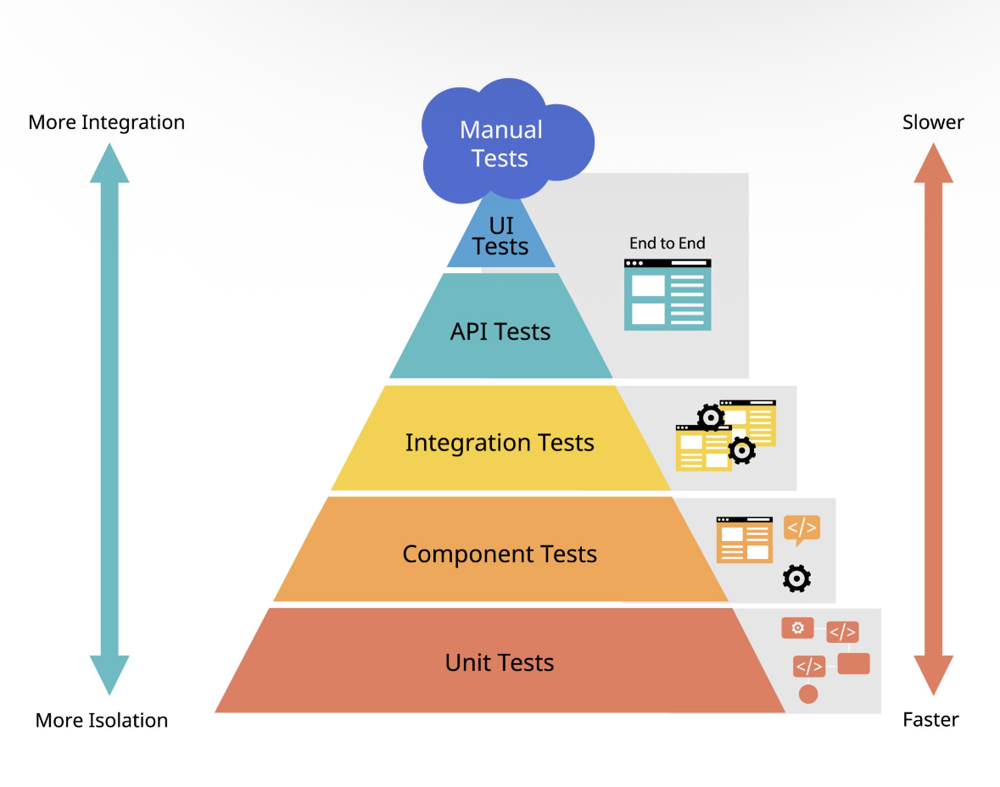

# Reporte de Testing — Pirámide de Tests

## Pirámide de Referencia



> **Principio:** La base de la pirámide (Unit Tests) debe tener la mayor cantidad de tests: son los más rápidos, aislados y baratos de mantener. A medida que se sube, los tests son más lentos, costosos y frágiles, pero validan más integración.

---

## Estado Actual: 150 tests / 20 archivos ✅

| Nivel | Cobertura | Tests | Archivos | Estado |
|-------|-----------|-------|----------|--------|
| **Unit Tests** | ✅ Cubierto | 85 | 10 | Sólido |
| **Component Tests** | ✅ Cubierto | 65 | 10 | Sólido |
| **Integration Tests** | ❌ Sin cobertura | 0 | 0 | Pendiente |
| **API Tests** | ❌ Sin cobertura | 0 | 0 | Pendiente |
| **UI Tests (E2E)** | ❌ Sin cobertura | 0 | 0 | Pendiente |
| **Manual Tests** | ⚠️ No documentados | — | — | Ad-hoc |

---

## 🟢 Unit Tests — 85 tests (57%)

Tests aislados de lógica de negocio pura. Sin DOM, sin dependencias externas, sin mocks complejos. Son los más rápidos (~5-17ms por archivo).

### Domain Entities

| Archivo | Tests | Tiempo |
|---------|-------|--------|
| `src/core/domain/entities/Reservation.test.js` | 23 | 17ms |
| `src/core/domain/entities/User.test.js` | 14 | 5ms |
| `src/core/domain/entities/InventoryItem.test.js` | 12 | 5ms |
| `src/core/domain/entities/Location.test.js` | 11 | 5ms |

### Domain Errors

| Archivo | Tests | Tiempo |
|---------|-------|--------|
| `src/core/domain/errors/AuthenticationError.test.js` | 8 | 4ms |

### Use Cases

| Archivo | Tests | Tiempo |
|---------|-------|--------|
| `src/application/use-cases/auth/RegisterUseCase.test.js` | 8 | 7ms |
| `src/application/use-cases/auth/LoginUseCase.test.js` | 5 | 14ms |
| `src/application/use-cases/reservations/CancelReservationUseCase.test.js` | 4 | 10ms |
| `src/application/use-cases/reservations/GetUserReservationsUseCase.test.js` | 3 | 10ms |

### Infrastructure Mappers

| Archivo | Tests | Tiempo |
|---------|-------|--------|
| `src/infrastructure/mappers/ReservationMapper.test.js` | 3 | 4ms |

### Qué validan

- ✅ Creación y validación de entidades de dominio (`User`, `Reservation`, `Location`, `InventoryItem`)
- ✅ Métodos de negocio (`isUpcoming()`, `isPast()`, `isCancelled()`, `getDisplayInfo()`)
- ✅ Errores tipados (`AuthenticationError`, `InvalidCredentialsError`, `RegistrationError`)
- ✅ Validaciones de casos de uso (campos requeridos, formato email, longitud contraseña)
- ✅ Mapeo DTO → Domain (`ReservationMapper`)

---

## 🟡 Component Tests — 65 tests (43%)

Tests de componentes React renderizados en aislamiento usando `jsdom` + `@testing-library/react`. Validan renderizado, interacción del usuario y navegación.

### Formularios

| Archivo | Tests | Tiempo |
|---------|-------|--------|
| `src/ui/components/auth/LoginForm.test.jsx` | 8 | 551ms |
| `src/ui/components/signup/SignupForm.test.jsx` | 8 | 596ms |

### Componentes UI

| Archivo | Tests | Tiempo |
|---------|-------|--------|
| `src/ui/components/common/Pagination.test.jsx` | 10 | 123ms |
| `src/ui/components/reservations/ReservationFilterBar.test.jsx` | 6 | 126ms |
| `src/ui/components/dashboard/SearchBar.test.jsx` | 4 | 78ms |
| `src/ui/components/reservations/ReservationList.test.jsx` | 4 | 62ms |
| `src/ui/components/common/ProtectedRoute.test.jsx` | 3 | 85ms |

### Páginas

| Archivo | Tests | Tiempo |
|---------|-------|--------|
| `src/routes/AppRouter.test.jsx` | 8 | 105ms |
| `src/ui/pages/auth/LoginPage.test.jsx` | 4 | 92ms |
| `src/ui/pages/signup/SignupPage.test.jsx` | 4 | 79ms |

### Qué validan

- ✅ Renderizado correcto de componentes
- ✅ Interacción de formularios (input, submit, validación)
- ✅ Navegación y rutas protegidas
- ✅ Filtros, búsqueda y paginación
- ✅ Estados de carga y error

---

## 🔴 Integration Tests — Sin cobertura

Tests que validan la interacción entre múltiples capas de la arquitectura hexagonal trabajando juntas.

### Qué debería cubrir

- ⬜ Use Case + Repository (con mock del HTTP client)
- ⬜ DI Container: verificar que todas las dependencias se resuelven correctamente
- ⬜ Hooks + Use Cases: validar que los hooks custom (`useLogin`, `useDashboard`, etc.) orquestan correctamente los casos de uso
- ⬜ Flujos completos: login → almacenar token → obtener usuario actual

### Herramientas recomendadas

- **Vitest** + mocks de infraestructura (HTTP, Storage)
- **MSW (Mock Service Worker)** para interceptar requests HTTP

---

## 🔴 API Tests — Sin cobertura

Tests que validan los contratos con los endpoints reales del backend.

### Qué debería cubrir

- ⬜ Contratos de response: estructura JSON esperada de cada endpoint
- ⬜ Códigos HTTP correctos (200, 401, 404, 500)
- ⬜ Headers de autenticación (Bearer token)
- ⬜ Validación de payloads enviados

### Herramientas recomendadas

- **MSW** para contract testing sin backend real
- **Vitest** con interceptores de Axios

---

## 🔴 UI Tests (E2E) — Sin cobertura

Tests end-to-end que simulan un usuario real interactuando con la aplicación completa.

### Qué debería cubrir

- ⬜ Flujo completo de login → dashboard → crear reserva → ver reservas
- ⬜ Flujo de registro → auto-login → dashboard
- ⬜ Cancelación de reserva
- ⬜ Navegación entre páginas
- ⬜ Tema claro/oscuro
- ⬜ Responsive behavior

### Herramientas recomendadas

- **Playwright** o **Cypress**

---

## Distribución Visual

```
                    ┌─────────┐
                    │ Manual  │  ⚠️ Ad-hoc
                    │  Tests  │
                   ┌┴─────────┴┐
                   │ UI / E2E  │  ❌ 0 tests
                  ┌┴───────────┴┐
                  │  API Tests  │  ❌ 0 tests
                 ┌┴─────────────┴┐
                 │  Integration  │  ❌ 0 tests
                ┌┴───────────────┴┐
                │ Component Tests │  ✅ 65 tests (43%)
               ┌┴─────────────────┴┐
               │    Unit Tests     │  ✅ 85 tests (57%)
               └───────────────────┘
```

---

## Resumen y Próximos Pasos

| Prioridad | Acción | Impacto |
|-----------|--------|---------|
| 🔴 Alta | Agregar Integration Tests (hooks + use cases + repos con mocks) | Detectar errores de wiring entre capas |
| 🟡 Media | Agregar API Contract Tests con MSW | Garantizar contratos backend-frontend |
| 🟡 Media | Agregar E2E Tests con Playwright | Validar flujos críticos de usuario |
| 🟢 Baja | Ampliar Unit Tests (mappers faltantes, más use cases edge cases) | Mayor cobertura de lógica |

---

*Generado el 24 de febrero de 2026 — 150 tests / 20 archivos / 0 fallos*
