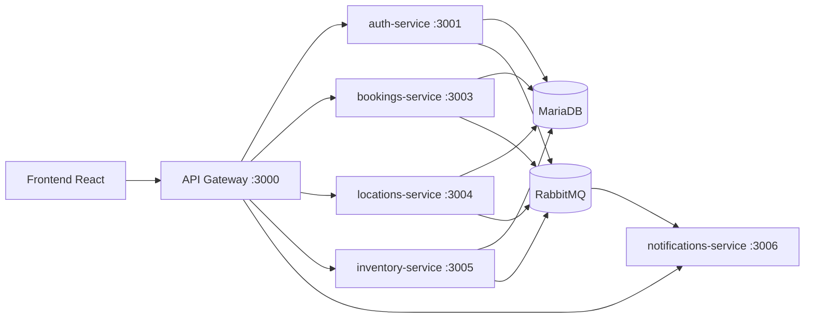

# Reservas SK

Sistema integral para la gestion de reservas de espacios y equipos, construido con una arquitectura de microservicios y notificaciones en tiempo real.

## Descripcion

El proyecto permite:
- gestionar usuarios y autenticacion
- crear y administrar reservas
- administrar inventario de equipos
- administrar ciudades y espacios
- recibir actualizaciones realtime cuando se crean/cancelan reservas

## Arquitectura



## Tecnologias

### Backend
- Java 17
- Spring Boot 3
- Spring Cloud Gateway
- Spring Security (JWT)
- Spring WebSocket (STOMP)
- Spring AMQP (RabbitMQ)
- JDBC + MariaDB
- Liquibase

### Frontend
- React + Vite
- Axios

### Infraestructura
- Docker / Docker Compose
- MariaDB
- RabbitMQ

## Servicios del Backend

| Servicio | Puerto | Funcion |
| --- | --- | --- |
| api-gateway | 3000 | Entrada unica y ruteo HTTP/WS |
| auth-service | 3001 | Registro, login, JWT, perfil |
| bookings-service | 3003 | Creacion/listado/cancelacion de reservas |
| locations-service | 3004 | Gestion de ciudades y espacios |
| inventory-service | 3005 | Gestion de equipos |
| notifications-service | 3006 | Broadcast de eventos por WebSocket |

## Eventos y Realtime

Mensajeria por RabbitMQ:
- Exchange: `reservas.events`
- Routing keys de dominio:
  - `auth.user.created`
  - `bookings.reservation.created`
  - `bookings.reservation.cancelled`
  - `inventory.equipment.*`
  - `locations.city.*`
  - `locations.space.*`

Realtime:
- Notifications service:
  - endpoint: `/notifications/ws`
  - topics: `/topic/events`, `/topic/events.{channel}`, `/topic/events.{routingKey}`
- Bookings service:
  - endpoint: `/bookings/ws`
  - topics:
    - `/topic/bookings.reservations`
    - `/topic/bookings.reservations.created`
    - `/topic/bookings.reservations.cancelled`

## Manejo de errores

Servicios principales usan respuesta estandar:
- `ok`
- `data`
- `message`
- `errorCode`

Esto facilita que frontend maneje errores por codigo estable.

## Ejecucion rapida

### Backend completo

Desde `Backend/`:

```bash
docker compose up --build
```

### Frontend

Desde `Frontend/`:

```bash
npm install
npm run dev
```

## Documentacion adicional

- Resumen general: `README.md`
- Detalle backend por servicio: `Backend/README.md`

