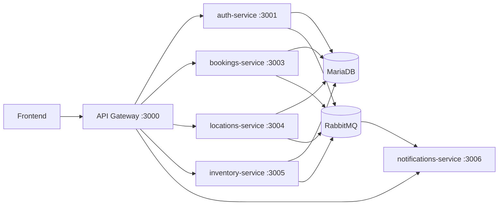

# Reservas SK

Sistema de reservas de espacios y equipos con arquitectura de microservicios, eventos y notificaciones en tiempo real.

## Stack Actual

- Frontend: React + Vite
- Backend: Spring Boot 3 (Java 17) + Spring Cloud Gateway
- Base de datos: MariaDB
- Mensajeria: RabbitMQ
- Migraciones: Liquibase
- Realtime: WebSocket STOMP

## Arquitectura



## Cambios Nuevos Relevantes

- Backend implementado con Spring Boot y Spring Cloud Gateway.
- Estandarizacion de errores con `errorCode` en servicios principales.
- Validaciones HTTP mas robustas en handlers globales (`400` claros para payload/params invalidos).
- Reservas con control de concurrencia para evitar doble reserva simultanea.
- Realtime para reservas entre pestanas:
  - `bookings-service` publica por WebSocket en:
    - `/topic/bookings.reservations`
    - `/topic/bookings.reservations.created`
    - `/topic/bookings.reservations.cancelled`
- `notifications-service` consume eventos de RabbitMQ y los difunde por WebSocket:
  - `/topic/events`
  - `/topic/events.{channel}`
  - `/topic/events.{routingKey}`

## Estructura del Repositorio

```text
reservas-sk/
  Backend/
    services/
      api-gateway/
      auth-service/
      bookings-service/
      inventory-service/
      locations-service/
      notifications-service/
      database/
    docker-compose.yml
    docker-compose.app.yml
  Frontend/
```

## Como Ejecutar

### Backend (stack completo)

Desde `Backend/`:

```bash
docker compose up --build
```

Servicios principales:
- API Gateway: `http://localhost:3000`
- Auth: `http://localhost:3001`
- Bookings: `http://localhost:3003`
- Locations: `http://localhost:3004`
- Inventory: `http://localhost:3005`
- Notifications: `http://localhost:3006`
- MariaDB: `localhost:3307`
- RabbitMQ UI: `http://localhost:15672`

### Frontend

Desde `Frontend/`:

```bash
npm install
npm run dev
```

## Documentacion Tecnica

- Detalle completo del backend: `Backend/README.md`
