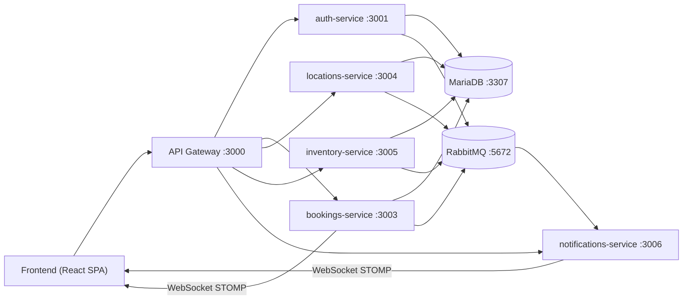

# Reservas SK

Sistema integral de reservas de espacios y equipos construido con arquitectura de microservicios, mensajeria basada en eventos y notificaciones en tiempo real.

---

## Tabla de Contenidos

- [Stack Tecnologico](#stack-tecnologico)
- [Arquitectura General](#arquitectura-general)
- [Estructura del Repositorio](#estructura-del-repositorio)
- [Backend — Microservicios](#backend--microservicios)
  - [Servicios y Puertos](#servicios-y-puertos)
  - [Endpoints REST](#endpoints-rest)
  - [Acceso a Datos](#acceso-a-datos)
  - [Seguridad](#seguridad)
  - [Mensajeria (RabbitMQ)](#mensajeria-rabbitmq)
  - [WebSocket y Realtime](#websocket-y-realtime)
  - [Migraciones de Base de Datos](#migraciones-de-base-de-datos)
  - [Manejo de Errores](#manejo-de-errores)
- [Frontend — React SPA](#frontend--react-spa)
  - [Stack Frontend](#stack-frontend)
  - [Arquitectura Hexagonal](#arquitectura-hexagonal)
  - [Scripts Disponibles](#scripts-disponibles)
- [Como Ejecutar](#como-ejecutar)
  - [Stack Completo (Produccion)](#stack-completo-produccion)
  - [Solo Backend (Desarrollo)](#solo-backend-desarrollo)
  - [Solo Frontend (Desarrollo)](#solo-frontend-desarrollo)
- [Variables de Entorno](#variables-de-entorno)
- [Infraestructura Docker](#infraestructura-docker)
  - [docker-compose.prod.yml (Stack Completo)](#docker-composeprodyml-stack-completo)
  - [docker-compose.override.yml (Dev)](#docker-composeoverrideyml-dev)
  - [Archivos Docker Generados](#archivos-docker-generados)

---

## Stack Tecnologico

| Capa | Tecnologia | Version |
| --- | --- | --- |
| **Frontend** | React | 19.2.0 |
| | React Router DOM | 7.13.0 |
| | Axios | 1.13.5 |
| | @stomp/stompjs | 7.3.0 |
| | Vite | 7.3.1 |
| | Vitest | 4.0.18 |
| | ESLint | 9.39.1 |
| **Backend** | Java | 17 |
| | Spring Boot | 3.4.1 |
| | Spring Cloud Gateway | 2024.0.0 |
| | Spring Security + JWT (jjwt) | 0.12.6 |
| | Spring AMQP (RabbitMQ) | — |
| | Spring WebSocket (STOMP) | — |
| **Base de datos** | MariaDB | 11 |
| **Migraciones** | Liquibase | 4.30 |
| **Mensajeria** | RabbitMQ | 3.13 |
| **Build** | Gradle (multi-modulo) | — |
| **Contenedores** | Docker / Docker Compose | — |

---

## Arquitectura General


```mermaid
flowchart LR
    FE["Frontend (React SPA)"] --> GW["API Gateway :3000"]
    GW --> AUTH["auth-service :3001"]
    GW --> BOOK["bookings-service :3003"]
    GW --> LOC["locations-service :3004"]
    GW --> INV["inventory-service :3005"]
    GW --> NOTI["notifications-service :3006"]

    AUTH --> DB[(MariaDB :3307)]
    BOOK --> DB
    LOC --> DB
    INV --> DB

    AUTH --> MQ[(RabbitMQ :5672)]
    BOOK --> MQ
    LOC --> MQ
    INV --> MQ
    MQ --> NOTI

    NOTI -- "WebSocket STOMP" --> FE
    BOOK -- "WebSocket STOMP" --> FE
```

---

## Estructura del Repositorio

```text
reservasSofka/
├── Backend/
│   ├── build.gradle                    # Configuracion raiz Gradle (Spring Boot 3.4.1)
│   ├── settings.gradle                 # Incluye los 6 subproyectos
│   ├── docker-compose.yml              # Stack completo (infra + servicios)
│   ├── docs/                           # Payloads de ejemplo y documentacion de API
│   └── services/
│       ├── api-gateway/                # Punto de entrada unico — ruteo HTTP y WS
│       ├── auth-service/               # Registro, login, perfil, JWT
│       ├── bookings-service/           # Disponibilidad, reservas, cancelaciones
│       ├── inventory-service/          # CRUD de equipos
│       ├── locations-service/          # CRUD de ciudades y espacios
│       ├── notifications-service/      # Broadcast de eventos (RabbitMQ → WebSocket)
│       └── database/                   # Liquibase changelogs y migraciones SQL
│
├── Frontend/
│   ├── package.json
│   ├── vite.config.js
│   ├── docs/                           # Documentacion de arquitectura y testing
│   └── src/
│       ├── core/                       # Dominio: entidades, puertos, adaptadores DI
│       ├── application/                # Casos de uso
│       ├── infrastructure/             # HTTP clients, repositorios, mappers, WebSocket
│       ├── ui/                         # Componentes, paginas, layouts, estilos
│       ├── routes/                     # Configuracion de rutas SPA
│       └── main.jsx                    # Composition Root
│
├── docker-compose.prod.yml              # Stack completo (Backend + Frontend + Infra)
├── docker-compose.override.yml          # Overrides para desarrollo (puertos individuales)
├── .env.example                         # Variables de entorno documentadas
└── HISTORIAS_DE_USUARIO.md              # Historias de usuario del proyecto
```

---

## Backend — Microservicios

### Servicios y Puertos

| Servicio | Puerto | Responsabilidad | Acceso a DB | Tecnologia de datos |
| --- | --- | --- | --- | --- |
| `api-gateway` | 3000 | Ruteo HTTP y WebSocket, punto de entrada unico | No | — |
| `auth-service` | 3001 | Registro, login, perfil, emision de JWT | Si | Spring Data JPA |
| `bookings-service` | 3003 | Disponibilidad, creacion/cancelacion de reservas, realtime | Si | Spring JDBC |
| `locations-service` | 3004 | Gestion de ciudades y espacios | Si | Spring JDBC |
| `inventory-service` | 3005 | Gestion de equipos | Si | Spring JDBC |
| `notifications-service` | 3006 | Consumo de eventos RabbitMQ y broadcast por WebSocket | No | — |

### Endpoints REST

#### auth-service (`/auth`)

| Metodo | Ruta | Auth | Descripcion |
| --- | --- | --- | --- |
| `POST` | `/auth/register` | No | Registro de usuario |
| `POST` | `/auth/login` | No | Login y emision de JWT |
| `GET` | `/auth/me` | Si | Perfil del usuario autenticado |
| `GET` | `/health` | No | Health check |

#### bookings-service (`/bookings`)

| Metodo | Ruta | Auth | Descripcion |
| --- | --- | --- | --- |
| `GET` | `/bookings/spaces/{spaceId}/availability` | Si | Consulta disponibilidad por rango |
| `POST` | `/bookings/reservations` | Si | Crea reserva |
| `GET` | `/bookings/reservations` | Si | Lista reservas (filtros opcionales) |
| `GET` | `/bookings/reservations/{id}` | Si | Obtiene reserva por id |
| `PATCH` | `/bookings/reservations/{id}/cancel` | Si | Cancela reserva |
| `GET` | `/health` | No | Health check |

#### locations-service (`/locations`)

| Metodo | Ruta | Auth | Descripcion |
| --- | --- | --- | --- |
| `POST` | `/locations/cities` | Si | Crea ciudad |
| `GET` | `/locations/cities` | Si | Lista ciudades |
| `GET` | `/locations/cities/{id}` | Si | Ciudad por id |
| `PUT` | `/locations/cities/{id}` | Si | Actualiza ciudad |
| `DELETE` | `/locations/cities/{id}` | Si | Elimina ciudad |
| `POST` | `/locations/spaces` | Si | Crea espacio |
| `GET` | `/locations/spaces` | Si | Lista espacios |
| `GET` | `/locations/spaces/{id}` | Si | Espacio por id |
| `PUT` | `/locations/spaces/{id}` | Si | Actualiza espacio |
| `DELETE` | `/locations/spaces/{id}` | Si | Elimina espacio |
| `GET` | `/health` | No | Health check |

#### inventory-service (`/inventory`)

| Metodo | Ruta | Auth | Descripcion |
| --- | --- | --- | --- |
| `POST` | `/inventory/equipments` | Si | Crea equipo |
| `GET` | `/inventory/equipments` | Si | Lista equipos |
| `GET` | `/inventory/equipments/{id}` | Si | Equipo por id |
| `PUT` | `/inventory/equipments/{id}` | Si | Actualiza equipo |
| `DELETE` | `/inventory/equipments/{id}` | Si | Elimina equipo |
| `GET` | `/health` | No | Health check |

#### notifications-service

| Metodo | Ruta | Auth | Descripcion |
| --- | --- | --- | --- |
| `GET` | `/notifications/health` | No | Health check |

### Acceso a Datos

| Servicio | Patron | Detalle |
| --- | --- | --- |
| `auth-service` | Spring Data JPA | Entidades con `@Entity`, repositorios JPA |
| `bookings-service` | Spring JDBC | `JdbcTemplate`, queries SQL explicitas |
| `inventory-service` | Spring JDBC | `JdbcTemplate`, queries SQL explicitas |
| `locations-service` | Spring JDBC | `JdbcTemplate`, queries SQL explicitas |

Todos los servicios usan `ddl-auto=none` o `validate` — la gestion de esquema la realiza Liquibase exclusivamente.

### Seguridad

- Autenticacion por **JWT Bearer** en todos los servicios de negocio.
- Libreria: `io.jsonwebtoken:jjwt 0.12.6`.
- Endpoints publicos: health checks, `/auth/register`, `/auth/login`.
- Cada servicio valida el token JWT de forma independiente.

### Mensajeria (RabbitMQ)

**Exchange:** `reservas.events`

| Routing Key | Origen |
| --- | --- |
| `auth.user.created` | auth-service |
| `bookings.reservation.created` | bookings-service |
| `bookings.reservation.cancelled` | bookings-service |
| `inventory.equipment.created` | inventory-service |
| `inventory.equipment.updated` | inventory-service |
| `inventory.equipment.deleted` | inventory-service |
| `locations.city.created` | locations-service |
| `locations.city.updated` | locations-service |
| `locations.city.deleted` | locations-service |
| `locations.space.created` | locations-service |
| `locations.space.updated` | locations-service |
| `locations.space.deleted` | locations-service |

`notifications-service` consume todas estas claves y las retransmite a clientes WebSocket.

### WebSocket y Realtime

#### notifications-service (bus de eventos en tiempo real)

- **Endpoint STOMP:** `/notifications/ws`
- **Topics:**
  - `/topic/events` — todos los eventos
  - `/topic/events.{channel}` — por canal
  - `/topic/events.{routingKey}` — por routing key especifica

#### bookings-service (realtime de reservas)

- **Endpoint STOMP:** `/bookings/ws`
- **Topics:**
  - `/topic/bookings.reservations` — cualquier cambio en reservas
  - `/topic/bookings.reservations.created` — reserva creada
  - `/topic/bookings.reservations.cancelled` — reserva cancelada

Permite refresco automatico entre pestanas concurrentes y control de concurrencia para evitar doble reserva.

### Migraciones de Base de Datos

Gestionadas por **Liquibase** (ejecuta como contenedor Docker one-shot al iniciar el stack).

Changelogs en `Backend/services/database/liquibase/changelog/`:

| Archivo | Descripcion |
| --- | --- |
| `db.changelog-master.yaml` | Changelog maestro |
| `001_init_schema_v1.sql` | Esquema inicial completo |
| `002_remove_username_unique_and_add_images.sql` | Ajustes de schema |
| `003_seed_data_v1.sql` | Datos semilla |
| `004_add_reservation_handover_logs.sql` | Logs de entrega de reservas |

### Manejo de Errores

Respuesta estandar en todos los servicios:

```json
{
  "ok": true|false,
  "data": { ... },
  "message": "...",
  "errorCode": "DOMAIN_ERROR_CODE"
}
```

Cada servicio cuenta con un `GlobalExceptionHandler` que mapea errores de negocio y validacion a respuestas HTTP consistentes (400, 401, 404, 409, etc.).

---

## Frontend — React SPA

### Stack Frontend

| Tecnologia | Version | Proposito |
| --- | --- | --- |
| React | 19.2.0 | Libreria de UI |
| React Router DOM | 7.13.0 | Enrutamiento SPA |
| Axios | 1.13.5 | Cliente HTTP |
| @stomp/stompjs | 7.3.0 | WebSocket STOMP en tiempo real |
| Vite | 7.3.1 | Bundler y dev server |
| Vitest | 4.0.18 | Framework de testing |
| Testing Library | React 16 / DOM 10 | Testing de componentes |
| ESLint | 9.39.1 | Linting y calidad de codigo |

**Gestion de estado:** React hooks nativos (`useState`, `useEffect`, `useCallback`, `useMemo`, `useRef`) + React Context. Sin librerias externas de estado.

### Arquitectura Hexagonal

El frontend implementa **Arquitectura Hexagonal (Ports & Adapters)** con separacion clara:

| Capa | Directorio | Responsabilidad |
| --- | --- | --- |
| **Dominio (Core)** | `src/core/domain/` | Entidades (`User`, `Reservation`, `Location`, `InventoryItem`), errores de dominio |
| **Puertos** | `src/core/ports/` | Interfaces de repositorios y servicios (`IAuthRepository`, `IHttpClient`, `IWebSocketService`, etc.) |
| **Adaptadores de entrada** | `src/core/adapters/` | Hooks adaptadores (`useLogin`, `useReservation`), DI container, providers |
| **Casos de uso** | `src/application/` | Auth (Login, Register, Logout), Reservas (Create, Cancel, GetAvailability), Dashboard |
| **Infraestructura** | `src/infrastructure/` | `AxiosHttpClient`, repositorios HTTP, mappers DTO↔Entity, `LocalStorageService`, `StompWebSocketService` |
| **Presentacion** | `src/ui/` | Componentes React, paginas, layouts, estilos |
| **Rutas** | `src/routes/` | Configuracion de rutas protegidas |

**Flujo de datos unidireccional:**

```
UI Component → Adapter Hook → Use Case → Port (Interface) → Repository (Infra) → API Backend
     ↑                                                                              │
     │                          Mapper (DTO → Entity)                               │
     └──────────────────────────────────────────────────────────────────────────────-┘
```

### Scripts Disponibles

```bash
npm run dev          # Servidor de desarrollo (Vite)
npm run build        # Build de produccion
npm run preview      # Preview del build
npm run test         # Tests en modo watch
npm run test:run     # Tests una sola ejecucion
npm run test:coverage # Tests con reporte de cobertura
npm run test:ci      # Tests para CI (JUnit XML + JSON + HTML)
npm run lint         # Linting con ESLint
npm run type-check   # Verificacion de tipos TypeScript
```

Cobertura minima configurada: **40%** (statements, branches, functions, lines).

---

## Como Ejecutar

### Stack Completo (Produccion)

Desde la **raiz del proyecto** — levanta backend, frontend, base de datos y mensajeria en un solo comando:

```bash
# Copiar y ajustar variables de entorno
cp .env.example .env

# Levantar todo el stack
docker compose -f docker-compose.prod.yml up --build -d

# Verificar estado de los contenedores
docker compose -f docker-compose.prod.yml ps
```

> **Podman:** si usas Podman rootless, reemplaza `docker compose` por `python -m podman_compose`.

| Servicio | URL |
| --- | --- |
| **Frontend (SPA + Reverse Proxy)** | `http://localhost:8080` |
| API Gateway (interno) | Solo accesible via frontend reverse proxy |
| RabbitMQ Management (solo dev) | `http://localhost:15672` (requiere override) |

El frontend en Nginx actua como reverse proxy: las rutas `/auth/*`, `/bookings/*`, `/inventory/*`, `/locations/*` y `/notifications/*` se redirigen automaticamente al API Gateway.

### Solo Backend (Desarrollo)

Desde `Backend/`:

```bash
docker compose up --build
```

Levanta solo la infraestructura (MariaDB, RabbitMQ, Liquibase) y los 6 microservicios con puertos expuestos:

| Servicio | URL |
| --- | --- |
| API Gateway | `http://localhost:3000` |
| Auth Service | `http://localhost:3001` |
| Bookings Service | `http://localhost:3003` |
| Locations Service | `http://localhost:3004` |
| Inventory Service | `http://localhost:3005` |
| Notifications Service | `http://localhost:3006` |
| MariaDB | `localhost:3307` |
| RabbitMQ Management | `http://localhost:15672` |

### Solo Frontend (Desarrollo)

Desde `Frontend/`:

```bash
npm install
npm run dev
```

Requiere que el backend este corriendo por separado. Configurar `VITE_API_URL=http://localhost:3000` en el entorno.

---

## Variables de Entorno

### Backend (comunes a todos los servicios)

| Variable | Descripcion |
| --- | --- |
| `DB_HOST`, `DB_PORT` | Host y puerto de MariaDB |
| `DB_USER`, `DB_PASSWORD` | Credenciales de base de datos |
| `DB_NAME` | Nombre de la base de datos |
| `JWT_SECRET` | Secreto para firma de tokens JWT |
| `RABBITMQ_ENABLED` | Habilitar/deshabilitar mensajeria |
| `RABBITMQ_HOST`, `RABBITMQ_PORT` | Host y puerto del broker |
| `RABBITMQ_USER`, `RABBITMQ_PASSWORD` | Credenciales de RabbitMQ |
| `RABBITMQ_EXCHANGE` | Nombre del exchange (`reservas.events`) |
| `WEBSOCKET_ALLOWED_ORIGINS` | Origenes permitidos para WebSocket |

### Backend (API Gateway)

| Variable | Descripcion |
| --- | --- |
| `AUTH_URL` | URL del auth-service |
| `BOOKINGS_URL` | URL del bookings-service |
| `INVENTORY_URL` | URL del inventory-service |
| `LOCATIONS_URL` | URL del locations-service |
| `NOTIFICATIONS_URL` | URL del notifications-service |
| `NOTIFICATIONS_WS_URL` | URL WebSocket del notifications-service |

### Frontend (build-time — Vite)

| Variable | Descripcion | Default (produccion) |
| --- | --- | --- |
| `VITE_API_URL` | URL base para llamadas REST | `http://localhost:8080` |
| `VITE_BOOKINGS_URL` | URL base para bookings | `http://localhost:8080` |
| `VITE_BOOKINGS_WS_URL` | URL WebSocket de reservas | `ws://localhost:8080/bookings/ws` |

> Estas variables se embeben en el bundle de JavaScript en tiempo de build. Para cambiarlas hay que reconstruir la imagen del frontend.

Referencia completa: [.env.example](.env.example)

---

## Infraestructura Docker

### docker-compose.prod.yml (Stack Completo)

Archivo principal en la raiz del proyecto. Levanta **toda la aplicacion** (frontend + backend + infra).

| Contenedor | Imagen | Puerto Host | Proposito |
| --- | --- | --- | --- |
| `reservas-mariadb` | `mariadb:11.4` | — (solo red interna) | Base de datos principal |
| `reservas-rabbitmq` | `rabbitmq:3.13-management-alpine` | — (solo red interna) | Broker de mensajeria |
| `reservas-liquibase` | `liquibase/liquibase:4.30` | — (one-shot) | Ejecucion de migraciones |
| `reservas-auth` | Build local | — (solo red interna) | Servicio de autenticacion |
| `reservas-bookings` | Build local | — (solo red interna) | Servicio de reservas |
| `reservas-locations` | Build local | — (solo red interna) | Servicio de ubicaciones |
| `reservas-inventory` | Build local | — (solo red interna) | Servicio de inventario |
| `reservas-notifications` | Build local | — (solo red interna) | Servicio de notificaciones |
| `reservas-gateway` | Build local | — (solo red interna) | Gateway HTTP/WS |
| `reservas-frontend` | Build local (Nginx) | `8080` | SPA + Reverse Proxy |

**Redes:** `backend_network` (comunicacion interna entre servicios) · `frontend_network` (frontend ↔ api-gateway)

**Volumenes:** `mariadb_data` · `rabbitmq_data`

**Seguridad aplicada:**
- Contenedores con usuario no-root
- `cap_drop: ALL` por defecto
- `read_only: true` en servicios que no escriben al filesystem
- Puertos de DB y broker no expuestos al host en produccion
- Healthchecks en todos los servicios
- Limites de recursos (CPU y memoria) por servicio
- Logging con `json-file`, rotacion `10m × 3`

### docker-compose.override.yml (Dev)

Overrides para desarrollo local — expone puertos individuales de cada servicio:

| Servicio | Puerto |
| --- | --- |
| API Gateway | `3000` |
| Auth | `3001` |
| Bookings | `3003` |
| Locations | `3004` |
| Inventory | `3005` |
| Notifications | `3006` |
| MariaDB | `3307` |
| RabbitMQ | `5672`, `15672` |
| Frontend | `5173` → `8080` |

Para usar los overrides de desarrollo:

```bash
docker compose -f docker-compose.prod.yml -f docker-compose.override.yml up --build -d
```

### Archivos Docker Generados

| Archivo | Ubicacion | Descripcion |
| --- | --- | --- |
| `docker-compose.prod.yml` | Raiz | Orquestacion completa (produccion) |
| `docker-compose.override.yml` | Raiz | Overrides para desarrollo |
| `.env.example` | Raiz | Variables de entorno documentadas |
| `Dockerfile` | Cada servicio en `Backend/services/*/` | Build multi-stage Java (Alpine) |
| `Dockerfile` | `Frontend/` | Build multi-stage React → Nginx |
| `nginx/default.conf` | `Frontend/` | Reverse proxy + SPA routing |
| `.dockerignore` | `Frontend/` | Exclusiones de build |

---

ISC License

## Documentacion Tecnica

- Detalle completo del backend: [Backend/README.md](Backend/README.md)
- Historias de usuario: [HISTORIAS_DE_USUARIO.md](HISTORIAS_DE_USUARIO.md)
- Variables de entorno: [.env.example](.env.example)
