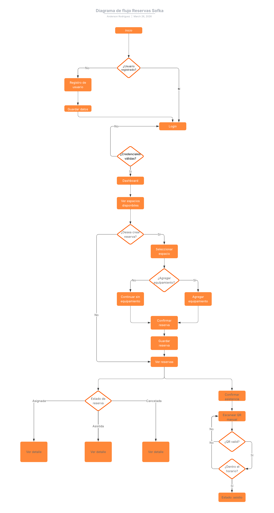
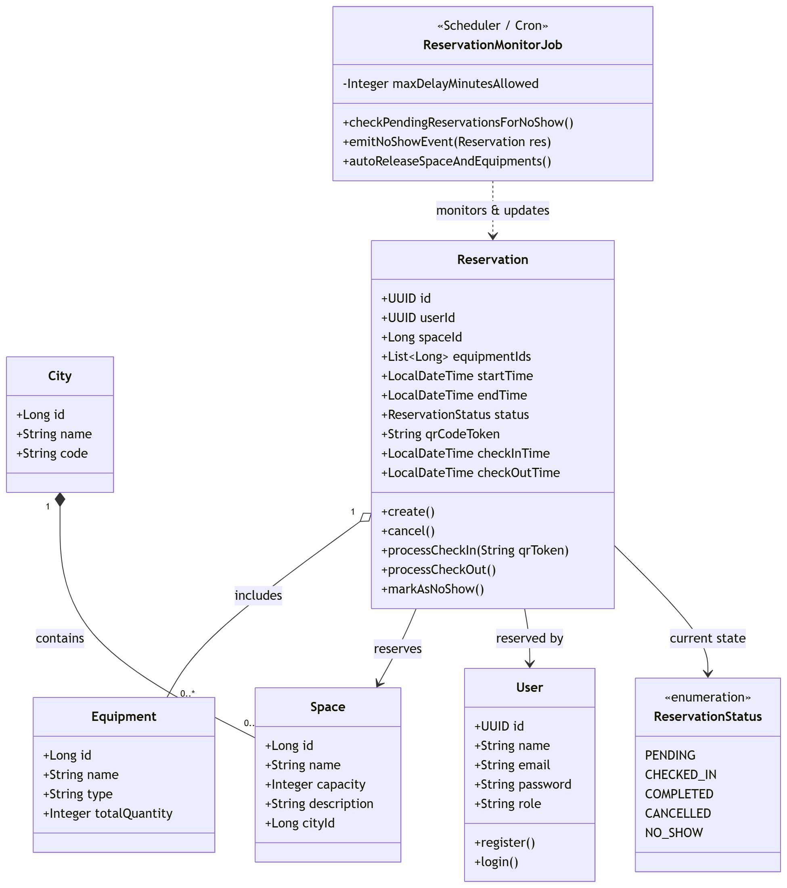
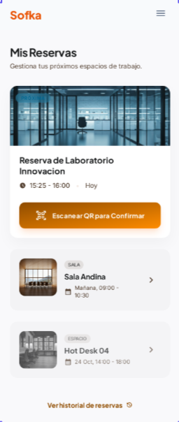
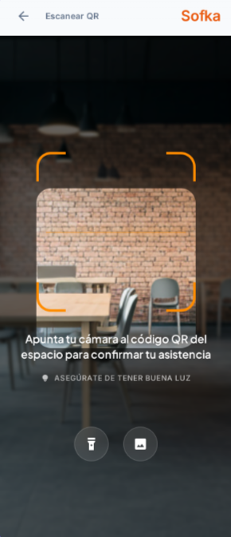

# HISTORIA DE USUARIO

# Verificación de reserva por QR

## ÍNDICE

1. [Resumen de la Feature](#1-resumen-de-la-feature)
   - [1.1 Propósito](#11-propósito)
   - [1.2 Contexto de Negocio](#12-contexto-de-negocio)
     - [Diagrama de Flujo](#diagrama-de-flujo)
     - [Diagrama de clases](#diagrama-de-clases)
   - [1.3 Objetivo y Métricas de Éxito](#13-objetivo-y-métricas-de-éxito)
2. [Alcance](#2-alcance)
3. [Historias de usuario y criterios de aceptación](#3-historias-de-usuario-y-criterios-de-aceptación)
4. [Requisitos no funcionales](#4-requisitos-no-funcionales)
5. [Riesgos y Dependencias](#5-riesgos-y-dependencias)
6. [Mockups](#6-mockups)
7. [Estimación de la historia de usuario](#7-estimación-de-la-historia-de-usuario)
8. [Definition of Ready (DoR)](#8-definition-of-ready-dor)
9. [Definition of Done (DoD)](#9-definition-of-done-dod)

---

## 1. Resumen de la Feature

### 1.1 Propósito

En las salas de reuniones y reservas de equipos, un problema muy común son las reservas fantasmas, personal que reserva pero no asiste lo que origina el espacio bloqueado. Por ende se plantea agregar una feature nueva donde se deba verificar la asistencia a dicho espacio por medio de lectura de un código QR, y si en determinado tiempo no se verifica dicha asistencia se cancelara dicha reserva y libera el espacio.

### 1.2 Contexto de Negocio

#### Diagrama de Flujo

  

#### Diagrama de clases

  

### 1.3 Objetivo y Métricas de Éxito

- Reducir en un 100% las reservas de espacios no ocupados y liberarlos al personal desde la primera semana post lanzamiento.

**Métricas de Seguimiento:**

Número de reservas en estado NO_SHOW vs reservas reasignadas el mismo día.

---

## 2. Alcance

**In-Scope**

- Adición de nuevos estados en el booking-service.
- Generación de token y QR en el booking-service.
- Desarrollo de endpoints donde se validará el token del QR para actualización del estado de la reserva.
- Desarrollo de JobQueue para liberación automática.

**Out-Scope**

- No se utilizara la ubicación del teléfono del usuario para hacer el auto-check.
- No se programara una aplicación móvil para el escáner.
- No se penalizará a los usuarios por cancelar la reserva.

---

## 3. Historias de usuario y criterios de aceptación

### Escaneo y confirmación de asistencia - HU-SOF-102.1

**Como** colaborador **quiero** confirmar mi asistencia escaneando el código QR de la sala, para hacer uso del espacio reservado sin que el sistema me lo cancele.

**Criterios BDD**

- **Given** que un colaborador autenticado tiene una reserva activa para un espacio en estado PENDING.
- **And** la hora actual se encuentra dentro del rango permitido (hasta 5 minutos después de la hora de inicio).
- **When** el colaborador escanea el código QR válido del espacio desde la plataforma web.
- **Then** el sistema actualiza el estado de la reserva a CHECKED_IN.
- **And** se muestra un mensaje de éxito en pantalla y se mantiene el espacio asignado.

### Manejo de Errores y QR Invalido - HU-SOF-102.2

**Como** sistema, **quiero** validar la autenticidad y correspondencia del QR escaneado, para evitar que un usuario haga check-in en una sala/espacio equivocado o con un código falso.

**Criterios BDD**

- **Given** que un colaborador intenta hacer check-in en un espacio.
- **When** el colaborador escanea un código QR que no corresponde a su reserva actual, está expirado, o es ilegible.
- **Then** el sistema muestra un mensaje de error claro en pantalla ("QR invalido o no corresponde a tu reserva actual").
- **And** el estado de la reserva original permanece en PENDING.

### Inasistencia Automática - HU-SOF-102.3

**Como** administrador de espacios, **quiero** que el sistema libere automáticamente las salas no reclamadas después de 5 minutos, para que otros colaboradores puedan utilizarlas.

**Criterios BDD**

- **Given** que una reserva se encuentra en estado PENDING.
- **And** han transcurrido más de 5 minutos desde la hora programada de inicio.
- **When** el sistema ejecuta el proceso automático ReservationMonitorJob.
- **Then** el estado de la reserva cambia automáticamente a NO_SHOW.
- **And** el espacio y los equipos asociados se marcan como "Disponibles" en el calendario general.

---

## 4. Requisitos no funcionales

- **Seguridad:** El código QR generado para cada sala debe contener un token (JWT) firmado digitalmente que se renueve cada 24 horas para evitar que los usuarios impriman o guarden fotos del QR para hacer check-in remoto.
- **Rendimiento:** El endpoint de validación (`POST /reservations/{id}/checkin`) debe tener un tiempo de respuesta (latencia) menor a 500ms para asegurar una experiencia fluida frente a la sala.
- **Usabilidad/Accesibilidad:** La interfaz de escaneo debe solicitar permisos de cámara de manera nativa en el navegador y mostrar una guía visual (marco de enfoque) adaptada a condiciones de baja luminosidad.

---

## 5. Riesgos y Dependencias

| Tipo | Descripción | Mitigación |
| :---- | :---- | :---- |
| **Riesgo** | Sobrecarga de base de datos debido a que el ReservationMonitorJob consulte miles de reservas por minuto. | Configurar el JobQueue para que ejecute en intervalos controlados y utilice índices optimizados en la base de datos. |
| **Riesgo** | Usuarios que no pueden escanear el QR por daños físicos en el impreso de la sala/espacio. | Proveer una opción de respaldo manual (ej. ingresar un pin numérico corto debajo del QR). |

---

## 6. Mockups

---

## 7. Estimación de la historia de usuario

| ID HU | Descripción | SP |
| :---- | :---- | :---: |
| HU 102.1 | Check-in Front/Back | 5 |
| HU 102.2 | Validaciones y Errores | 2 |
| HU 102.3 | JobQueue | 5 |
| **Total de la Feature** | | **12** |

---

## 8. Definition of Ready (DoR)

- [ ] Los flujos principales y excepciones están cubiertos con Criterios de Aceptación claros (Gherkin).
- [ ] Los mockups de UI están adjuntos y aprobados.
- [ ] Se han definido los parámetros exactos de negocio (Ej. tiempo de gracia = 5min).
- [ ] La feature ha sido dividida en historias lo suficientemente pequeñas (INVEST) para entrar en el sprint.

---

## 9. Definition of Done (DoD)

- [ ] El código se compila y se ejecuta sin errores y cumple con los estándares del proyecto (Linting).
- [ ] Los endpoints desarrollados cuentan con pruebas unitarias y de integración pasando correctamente.
- [ ] La cobertura de código (Code Coverage) de las nuevas clases/métodos es igual o superior al 90%.
- [ ] La funcionalidad ha sido validada en el entorno de Staging/QA utilizando dispositivos móviles reales para probar la cámara.
- [ ] Se ha realizado la revisión de código en pares (Peer Review) mediante un PR aprobado.
