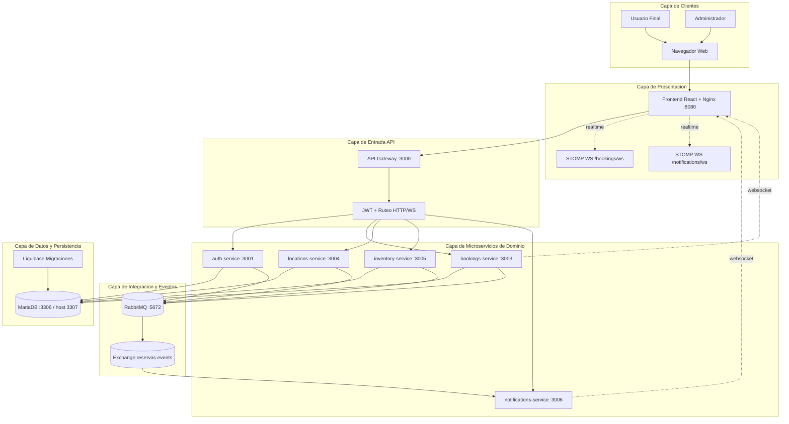
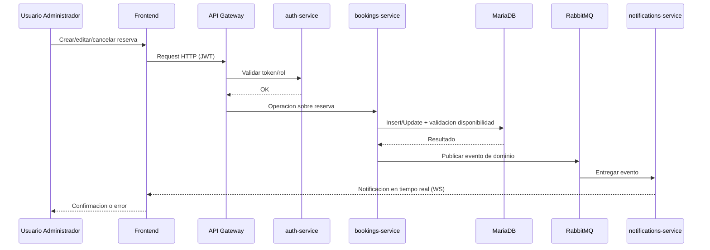
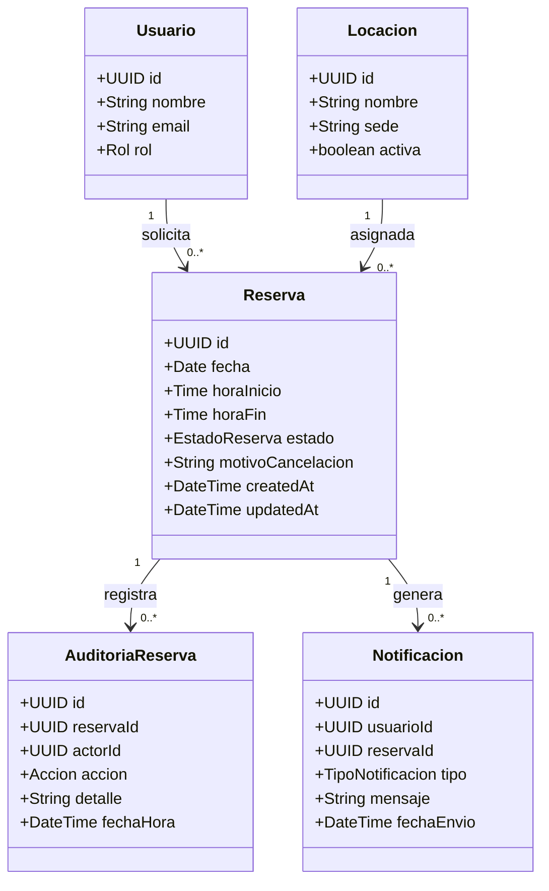

# Diagramas del Proyecto Reservas SK

Este documento incluye un diagrama de arquitectura completo del proyecto y diagramas funcionales de la HU de modulo administrador.

## 1. Diagrama de Arquitectura General (todo el proyecto)

Diagrama por capas para visualizar de forma intuitiva el funcionamiento end-to-end.

## 2. Flujo Clave (Admin) - Gestion de reservas

## 3. Diagrama de Clases de Dominio (HU modulo administrador)

## 4. Fuentes de referencia usadas
- `compose.yml` (servicios, puertos y dependencias reales)
- `README.md` (arquitectura, mensajeria, websocket y endpoints)
- `Frontend/nginx/default.conf` (reverse proxy y rutas websocket)
- `docs/HU_modulo_administrador.docx` (flujo funcional de la HU)
