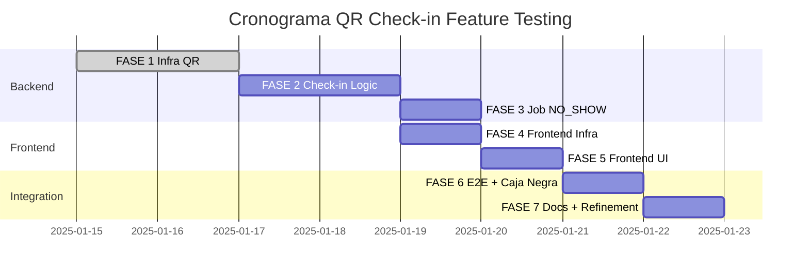

# TEST PLAN Feature Verificación de Reserva por QR (HU-SOF-102)

> **Versión:** 1.0  
> **Fecha:** 6 de abril de 2026  
> **Proyecto:** Sistema de Reservas Sofka - QR Check-in Feature  
> **Story Points:** 12 SP  
> **Autores:** Equipo de Desarrollo Reservas SK  
> **Basado en:** ISTQB Test Plan Template

---

## Tabla de Contenidos

1. [Identificador y Resumen Ejecutivo](#1-identificador-y-resumen-ejecutivo)
2. [Alcance (Scope)](#2-alcance-scope)
3. [Estrategia y Enfoque de Pruebas](#3-estrategia-y-enfoque-de-pruebas)
4. [Criterios de Aceptación y Suspensión](#4-criterios-de-aceptación-y-suspensión)
5. [Entorno de Pruebas (Test Environment)](#5-entorno-de-pruebas-test-environment)
6. [Entregables de Prueba (Test Deliverables)](#6-entregables-de-prueba-test-deliverables)
7. [Recursos y Responsabilidades](#7-recursos-y-responsabilidades)
8. [Cronograma (Schedule)](#8-cronograma-schedule)
9. [Riesgos y Contingencias](#9-riesgos-y-contingencias)
10. [Anexos](#10-anexos)
    - [10.1 Test Cases Detallados](#101-test-cases-detallados)
    - [10.2 Inventario de Tests](#102-inventario-de-tests)
    - [10.3 Técnicas de Diseño de Pruebas](#103-técnicas-de-diseño-de-pruebas)

---

## 1. Identificador y Resumen Ejecutivo

### 1.1 Identificación del Plan

| Atributo | Valor |
|----------|-------|
| **ID del Plan** | TP-QR-CHECKIN-001 |
| **Nombre del Proyecto** | Sistema de Reservas Sofka |
| **Feature** | HU-SOF-102: Verificación de Reserva por QR |
| **Versión del Plan** | 1.0 |
| **Fecha de Creación** | 6 de abril de 2026 |
| **última Actualización** | 6 de abril de 2026 |
| **Autor Principal** | Equipo de Desarrollo Reservas SK |
| **Aprobadores** | Tech Lead, QA Lead |
| **Estado** | En Progreso (FASE 1 completada) |
| **Story Points** | 12 SP |

### 1.2 Contextualización de la Feature

La feature **HU-SOF-102: Verificación de Reserva por QR** introduce un sistema de check-in mediante códigos QR para combatir el problema de "reservas fantasma" - espacios reservados pero no ocupados que bloquean recursos para otros colaboradores.

**Problema de negocio:** Actualmente, el 100% de los espacios reservados permanecen bloqueados incluso cuando el usuario no asiste, generando desperdicio de recursos y frustración en otros colaboradores que requieren el espacio.

**Solución propuesta:** Sistema automatizado de verificación de asistencia mediante QR que:
1. Genera códigos QR únicos por espacio (permanentes)
2. Valida la presencia del usuario escaneando el QR desde la cámara del dispositivo
3. Actualiza el estado de la reserva a CHECKED_IN
4. Libera automáticamente espacios no verificados tras 5 minutos (estado NO_SHOW)

### 1.3 Objetivos del Plan de Pruebas

| Objetivo | Métrica de í‰xito |
|----------|------------------|
| **Cobertura de código** | ≥90% en lí­neas, ≥85% en branches (código nuevo) |
| **Detección temprana de defectos** | 80% de bugs encontrados en tests unitarios/componente |
| **Validación funcional completa** | 100% de criterios BDD de las 3 sub-historias verificados |
| **Estabilidad del sistema** | 0 bugs de severidad crí­tica al momento de despliegue |
| **Documentación de pruebas** | 100% de test cases documentados con trazabilidad a HUs |

### 1.4 Componentes bajo prueba (SUT)

| Componente | Funcionalidad | Complejidad | Riesgo |
|------------|--------------|-------------|--------|
| **locations-service** | Generación de QR permanentes (JWT) + imagen PNG | Media | Medio |
| **bookings-service** | Validación de QR, check-in, estado CHECKED_IN/NO_SHOW | Alta | Alto |
| **Frontend (React)** | Scanner QR con html5-qrcode, permisos de cámara | Media | Medio |
| **ReservationMonitorJob** | Job schedulado (cada 1 min) para marcar NO_SHOW | Alta | Alto |
| **Database migrations** | Nuevas columnas en tables `reservations` y `spaces` | Baja | Bajo |

---

## 2. Alcance (Scope)

### 2.1 Historias de Usuario en Scope

| ID HU | Descripción | Criterios BDD | Prioridad | Estado Testing |
|-------|-------------|--------------|-----------|----------------|
| **HU-SOF-102.1** | Escaneo y confirmación de asistencia | Given reserva PENDING When escanea QR válido Then estado → CHECKED_IN | Alta | 25 tests planificados |
| **HU-SOF-102.2** | Manejo de errores y QR inválido | Given intento check-in When QR inválido Then error + PENDING | Alta | 18 tests planificados |
| **HU-SOF-102.3** | Inasistencia automática | Given reserva PENDING >5min When job ejecuta Then NO_SHOW | Alta | 15 tests planificados |

### 2.2 Funcionalidades a Probar (In-Scope)

#### Backend - bookings-service

- [x] Generación de JWT permanente para QR (sin expiración)
- [x] Validación de firma JWT del token QR escaneado
- [ ] Endpoint `POST /reservations/{id}/checkin` con validación de QR
- [ ] Validación spaceId del token QR vs. spaceId de la reserva
- [ ] Actualización de estado PENDING → CHECKED_IN con timestamp UTC
- [ ] Validación de grace period (check-in dentro de 5 min post-inicio)
- [ ] Job schedulado `ReservationMonitorJob` ejecutándose cada 1 minuto
- [ ] Query optimizada `findExpiredPendingReservations()` con í­ndices
- [ ] Update batch idempotente para marcar NO_SHOW
- [ ] Publicación de eventos `ReservationCheckedInEvent` y `ReservationNoShowEvent`
- [ ] Logs de auditorí­a de intentos de check-in (éxito/fallo)

#### Backend - locations-service

- [x] Generación de imagen QR PNG (300x300px) con ZXing
- [x] Almacenamiento de QR code en BD (campo `qr_code`)
- [x] Cálculo de ETag (SHA-256) para caché del QR
- [ ] Endpoint `GET /spaces/{id}/qr` retornando imagen PNG
- [ ] Headers de caché optimizados (Cache-Control, ETag, If-None-Match)
- [ ] Validación condicional (respuesta 304 Not Modified)
- [ ] Generación automática de QR al crear un espacio nuevo

#### Frontend - React SPA

- [ ] Hook `useQrScanner` con integración html5-qrcode
- [ ] Solicitud de permisos de cámara (`navigator.mediaDevices.getUserMedia`)
- [ ] Componente `QrScannerModal` con preview de cámara
- [ ] Decodificación de QR y enví­o al backend
- [ ] Manejo de errores (QR inválido, permisos denegados)
- [ ] Actualización de `ReservationCard` con badges CHECKED_IN/NO_SHOW
- [ ] Use case `CheckInReservationUseCase.ts` para orquestar check-in
- [ ] Método `canCheckIn()` en entidad `Reservation` (dominio frontend)

#### Base de Datos

- [x] Migración SQL: columnas `qr_token`, `checked_in_at` en `reservations`
- [x] Migración SQL: columnas `qr_code`, `qr_token`, `qr_etag` en `spaces`
- [x] Índices: `idx_reservations_status_start` en `(status, start_datetime)`
- [x] Índice: `idx_spaces_qr_token` en `qr_token`

### 2.3 Tipos de Pruebas a Ejecutar

| Tipo de Prueba | Aplica | Cantidad de Tests | Herramienta |
|----------------|--------|-------------------|-------------|
| **Unitarias** | Backend + Frontend | 47 tests | JUnit 5 + Mockito / Vitest + vi.fn() |
| **Componente** | Backend + Frontend | 20 tests | @WebMvcTest + MockMvc / @testing-library/react |
| **Integración** | Backend + Frontend | 8 tests | @JdbcTest + H2 / Fakes + mappers reales |
| **End-to-End** | UI completa | 3 tests | Selenium WebDriver (Chrome) |
| **Caja Negra API** | HTTP real | 3 tests | curl + bash scripting |
| **Regresión** | Tests existentes afectados | ~15 tests | Suite completa del proyecto |
| **Funcional** | Validación de criterios BDD | 100% HUs | Todos los niveles |

### 2.4 Módulos/Integraciones a Probar

| Integración | Componentes | Qué se valida |
|-------------|------------|---------------|
| **bookings †” locations** | Validación de QR token con spaceId | Token generado en locations es válido en bookings |
| **Frontend †” API Gateway** | Endpoints de check-in | Request/response HTTP correcto |
| **bookings †” MariaDB** | Persistencia de estados | Queries SQL + transacciones |
| **bookings †” RabbitMQ** | Eventos así­ncronos | Publicación de eventos CheckedIn/NoShow |
| **WebSocket †” Frontend** | Notificaciones en tiempo real | Actualización de UI sin refresh |

### 2.5 Sistemas bajo prueba (SUT) - Detalle técnico

| Servicio/Componente | Tecnologí­a | Lí­neas de código nuevas (estimado) | Tests requeridos |
|---------------------|-----------|-----------------------------------|------------------|
| `bookings-service` | Spring Boot 3.4.1 / Java 17 | ~400 LOC | 35+ tests |
| `locations-service` | Spring Boot 3.4.1 / Java 17 | ~250 LOC | 20+ tests |
| Frontend QR Scanner | React 19 / TypeScript 5 | ~300 LOC | 25+ tests |
| Database migrations | SQL (MariaDB 11.4) | 2 scripts | Validación en integración |
| **Total estimado** | | **~950 LOC** | **80+ tests** |

### 2.6 Fuera de Alcance (Out-of-Scope)

| Elemento | Razón |
|----------|-------|
| **Pruebas en dispositivos móviles nativos** | Solo se probará web responsive en navegador móvil (Selenium con Chrome mobile emulation) |
| **Pruebas de rendimiento/carga** | Se asume carga normal (<100 check-ins simultáneos). No se ejecutarán pruebas con JMeter/Gatling |
| **Pruebas de seguridad ofensiva** | Penetration testing está fuera del scope del equipo de desarrollo. JWT signing se considera seguro |
| **Pruebas de accesibilidad WCAG** | El scanner QR no será validado contra estándares WCAG 2.1 |
| **Tests de QR en diferentes superficies** | No se probarán QRs impresos en papel/acrí­lico con diferentes iluminaciones (hardware) |
| **Tests de múltiples navegadores** | Solo Chrome (Selenium). Firefox/Safari están out-of-scope |
| **PIN numérico de respaldo** | Funcionalidad de respaldo manual no está en este sprint |
| **Notificaciones push móviles** | Solo notificaciones WebSocket en web |

---

## 3. Estrategia y Enfoque de Pruebas

### 3.1 Enfoque General

El enfoque de testing para la feature QR Check-in sigue una **estrategia hí­brida** que combina:

- **Testing basado en riesgo:** Mayor cobertura en componentes de alto riesgo (job NO_SHOW, validación JWT)
- **Test-Driven Development (TDD):** Tests escritos antes/durante el desarrollo (FASE 1 completada con 26 tests)
- **Pirámide de testing:** 60% unitarios, 25% componente, 10% integración, 5% E2E
- **Shift-left:** Detección temprana de defectos en niveles unitarios
- **Automatización:** 100% de tests automatizados (sin tests manuales)

### 3.2 Niveles de Prueba

#### 3.2.1 Test Pyramid para QR Feature

```
                    ╱      ╲
                   ╱  E2E   ╲                ← 5 tests (6%)
                  ╱──────────╲                 Selenium + curl
                 ╱ Integration ╲            ← 8 tests (10%)
                ╱──────────────╲             JDBC + scheduler + eventos
               ╱   Component    ╲         ← 20 tests (25%)
              ╱──────────────────╲           @WebMvcTest +   render()
             ╱   Unit Tests       ╲       ← 47 tests (59%)
            ╱──────────────────────╲         Mockito + vi.fn()
           ╱________________________╲
                Total: 80 tests
```

#### 3.2.2 Tests Unitarios (Base - 47 tests)

**Objetivo:** Validar lógica de negocio y funciones individuales de forma aislada, con todas las dependencias mockeadas.

**Backend (28 tests)**

| Clase bajo test | Tipo | Dependencias | Tests | Estado |
|----------------|------|-------------|-------|--------|
| `JwtQrTokenGeneratorAdapter` | Adapter | JwtProperties (real) | 11 | ✅ Completado |
| `QrCodeImageGeneratorAdapter` | Adapter | QrProperties (real) | 7 | ✅ Completado |
| `CheckInReservationUseCase` | Use Case | Puertos mockeados | 8 | ⏳ FASE 2 |
| `ReservationMonitorJob` | Scheduled Job | Persistencia mockeada | 5 | ⏳ FASE 3 |
| `Reservation.canCheckIn()` | Domain logic | Ninguna | 3 | ✅ Completado (parcial) |
| `QrProperties` | Config | Ninguna | 5+5 | ✅ Completado |

**Frontend (19 tests)**

| Clase/Hook/Componente | Tipo | Dependencias | Tests | Estado |
|-----------------------|------|-------------|-------|--------|
| `CheckInReservationUseCase.ts` | Use Case | IReservationRepository mock | 4 | ⏳ FASE 4 |
| `useQrScanner.ts` | Hook | html5-qrcode mock | 6 | ⏳ FASE 4 |
| `useCheckIn.ts` | Hook | useCase mock | 3 | ⏳ FASE 5 |
| `Reservation.canCheckIn()` | Domain entity | Ninguna | 3 | ⏳ FASE 4 |
| `QrTokenValidator.ts` | Utility | Ninguna | 3 | ⏳ FASE 4 |

**Caracterí­sticas:**
- Ejecución: <50ms por test
- Frameworks: JUnit 5 + Mockito / Vitest + `vi.fn()`
- Mocking: `when/verify` (Mockito), `vi.fn()` (Vitest)
- Sin infraestructura: ni BD, ni HTTP, ni cámara

#### 3.2.3 Tests de Componente (20 tests)

**Objetivo:** Validar que un componente/módulo funciona correctamente dentro de su slice, sin levantar la aplicación completa.

**Backend (10 tests)**

| Componente | Framework | Tests | Estado |
|------------|-----------|-------|--------|
| `BookingController.checkIn()` | `@WebMvcTest` + `MockMvc` | 5 | ⏳ FASE 2 |
| `GlobalExceptionHandler` QR errors | `@WebMvcTest` | 2 | ⏳ FASE 2 |
| `GET /spaces/{id}/qr` endpoint | `@WebMvcTest` | 3 | ⏳ FASE 2 |

**Frontend (10 tests)**

| Componente | Framework | Tests | Estado |
|------------|-----------|-------|--------|
| `QrScannerModal` | `@testing-library/react` | 5 | ⏳ FASE 5 |
| `ReservationCard` (badge CHECKED_IN/NO_SHOW) | `@testing-library/react` | 3 | ⏳ FASE 5 |
| Routing: `/reservations/:id/checkin` | `render` + `MemoryRouter` | 2 | ⏳ FASE 5 |

**Caracterí­sticas:**
- Backend: Web slice levantado; servicios mockeados con `@MockBean`
- Frontend: jsdom + componentes renderizados; hooks mockeados
- Validación HTTP: status codes, JSON structure, error messages
- Validación UI: texto visible, botones habilitados/deshabilitados, badges

#### 3.2.4 Tests de Integración (8 tests)

**Objetivo:** Validar la comunicación real entre capas - que los puertos, adapters y la infraestructura trabajan juntos correctamente.

**Backend (6 tests)**

| Componente | Framework | Qué valida | Tests | Estado |
|------------|-----------|-----------|-------|--------|
| `JdbcBookingPersistenceAdapter.updateReservationStatusBatch()` | `@JdbcTest` + H2 | SQL update masivo correcto | 2 | ⏳ FASE 3 |
| `JdbcBookingPersistenceAdapter.findExpiredPendingReservations()` | `@JdbcTest` + H2 | Query con í­ndice optimizado | 2 | ⏳ FASE 3 |
| `ReservationMonitorJob` con scheduler real | `@SpringBootTest` con `@Scheduled` | Job ejecuta cada 1 min | 1 | ⏳ FASE 3 |
| Publicación de eventos RabbitMQ | Mock de `RabbitTemplate` | `verify` de publish | 1 | ⏳ FASE 3 |

**Frontend (2 tests)**

| Flujo | Framework | Qué valida | Tests | Estado |
|-------|-----------|-----------|-------|--------|
| `qr-checkin-flow.integration.test.ts` | Vitest + fakes | Scan → UseCase → Mapper → Entity | 2 | ⏳ FASE 6 |

**Caracterí­sticas:**
- Backend: Contexto Spring parcial (JDBC/JPA slice)
- Frontend: Repositorios fake con lógica real de mappers
- BD: H2 in-memory con schema completo
- No mocks: Lógica de persistencia y mapping es real

#### 3.2.5 Tests E2E / Caja Negra (5 tests)

**Objetivo:** Validar el sistema como lo verí­a un cliente HTTP externo / usuario final, con todos los servicios reales levantados.

**E2E con Selenium WebDriver (3 tests)**

| Test case | Flujo | Duración estimada | Estado |
|-----------|-------|-------------------|--------|
| TC-E2E-QR-001 | Login → Ver reserva → Escanear QR → Ver badge CHECKED_IN | ~15s | ⏳ FASE 6 |
| TC-E2E-QR-002 | Login → Escanear QR incorrecto → Ver mensaje error | ~10s | ⏳ FASE 6 |
| TC-E2E-QR-003 | Crear reserva → Esperar 5min (mock) → Ver badge NO_SHOW | ~20s | ⏳ FASE 6 |

**Caja Negra API con curl (2 tests)**

| Test case | Endpoint | Validación | Estado |
|-----------|----------|-----------|--------|
| TC-BB-QR-001 | `POST /reservations/{id}/checkin` | 200 + `status: "checked_in"` | ⏳ FASE 6 |
| TC-BB-QR-002 | `POST /reservations/{id}/checkin` con QR malo | 400 + `errorCode: "QR_TOKEN_INVALID"` | ⏳ FASE 6 |

**Caracterí­sticas:**
- Stack completo levantado: MariaDB + RabbitMQ + todos los servicios
- Frontend Selenium: navegador real (Chrome)
- API curl: desde contenedor Docker en red interna
- Validación: comportamiento observable externo, sin conocer código interno

### 3.3 Tipos de Pruebas por Objetivo

| Tipo | Descripción | Nivel | Cobertura |
|------|-------------|-------|-----------|
| **Funcional** | Validación de criterios BDD de las 3 HUs | Todos | 100% de HUs |
| **Regresión** | Re-ejecutar tests existentes afectados por cambios | Unitarios + Componente | ~15 tests existentes |
| **Caja Blanca** | Validación de lógica interna con conocimiento del código | Unitarios + Componente | 67 tests |
| **Caja Negra** | Validación de comportamiento observable sin conocer internals | E2E + API | 5 tests |
| **Humo (Smoke)** | Verificación básica de que el sistema inicia correctamente | Integración | `*ApplicationTests.java` |
| **Seguridad** | Validación de JWT signing, sanitización de logs | Unitarios | Tests de JwtQrTokenGeneratorAdapter |

### 3.4 Estrategia por Historia de Usuario

#### HU-SOF-102.1: Check-in exitoso

**Criterio BDD:** *Given* reserva PENDING *When* escaneo QR válido *Then* estado → CHECKED_IN

| Nivel de testing | Qué se verifica | Cantidad de tests |
|------------------|----------------|-------------------|
| **Unitario - Backend** | `CheckInReservationUseCase` con mocks valida lógica | 8 tests |
| **Componente - Backend** | `BookingController.checkIn()` retorna 200 + JSON correcto | 3 tests |
| **Integración - Backend** | Persistencia JDBC actualiza BD correctamente | 2 tests |
| **Unitario - Frontend** | `CheckInReservationUseCase.ts` llama al repositorio | 4 tests |
| **Componente - Frontend** | `QrScannerModal` renderiza y dispara check-in | 5 tests |
| **E2E** | Escanear QR → ver badge CHECKED_IN en ReservationCard | 2 tests |
| **Caja Negra API** | `POST /reservations/{id}/checkin` con token válido → 200 | 1 test |

**Total HU-SOF-102.1:** 25 tests

#### HU-SOF-102.2: Validación de QR inválido

**Criterio BDD:** *Given* intento check-in *When* QR inválido/incorrecto *Then* error + estado PENDING

| Nivel de testing | Qué se verifica | Cantidad de tests |
|------------------|----------------|-------------------|
| **Unitario -Backend** | `JwtQrTokenGeneratorAdapter` rechaza firma incorrecta | 3 tests |
| **Unitario - Backend** | `CheckInReservationUseCase` lanza `SPACE_MISMATCH` | 4 tests |
| **Componente - Backend** | `GlobalExceptionHandler` retorna 400/409 con error code | 2 tests |
| **Unitario - Frontend** | `useQrScanner` maneja errores de decodificación | 3 tests |
| **Componente - Frontend** | `QrScannerModal` muestra mensaje de error | 3 tests |
| **E2E** | Escanear QR de sala incorrecta → mensaje "QR no corresponde" | 1 test |
| **Caja Negra API** | `POST /checkin` con token malformado → 400 | 2 tests |

**Total HU-SOF-102.2:** 18 tests

#### HU-SOF-102.3: Liberación automática (NO_SHOW)

**Criterio BDD:** *Given* reserva PENDING >5min *When* job ejecuta *Then* estado → NO_SHOW

| Nivel de testing | Qué se verifica | Cantidad de tests |
|------------------|----------------|-------------------|
| **Unitario - Backend** | `ReservationMonitorJob` detecta reservas expiradas | 5 tests |
| **Unitario - Backend** | `Reservation.canCheckIn()` retorna false fuera de gracia | 3 tests |
| **Integración - Backend** | Query SQL `findExpiredPendingReservations()` correcto | 2 tests |
| **Integración - Backend** | Job es idempotente (no duplica NO_SHOW) | 2 tests |
| **Componente - Frontend** | `ReservationCard` muestra badge NO_SHOW | 2 tests |
| **E2E** | Reserva no verificada → badge cambia a NO_SHOW tras 5min | 1 test (con mock de tiempo) |

**Total HU-SOF-102.3:** 15 tests

---

## 4. Criterios de Aceptación y Suspensión

### 4.1 Criterios de Entrada (Entry Criteria)

**Requisitos de desarrollo:**

- [ ] **Código completado:** FASE correspondiente del `planHUQR.md` implementada
- [ ] **Build exitoso:** `./gradlew clean build` sin errores de compilación
- [ ] **Dependencias resueltas:** ZXing (`com.google.zxing:core:3.5.3`) agregado en ambos servicios
- [ ] **Migraciones aplicadas:** Scripts SQL `005-qr-checkin-support.sql` ejecutados en BD dev
- [ ] **Configuración:** Propiedades `qr.checkin.grace-period-minutes` y `qr.image.size` en `application.yml`

**Requisitos de infraestructura:**

- [ ] **Ambiente de desarrollo listo:** MariaDB 11.4 + RabbitMQ 3.13 levantados localmente
- [ ] **BD con schema actualizado:** Índices creados en `(status, start_datetime)` y `qr_token`
- [ ] **Servicios accesibles:** `bookings-service:3003` y `locations-service:3004` respondiendo
- [ ] **Frontend compilando:** `npm install` sin errores + `npm run dev` funcional

**Requisitos de testing:**

- [ ] **Tests previos pasando:** Suite de regresión del proyecto (>1000 tests) en verde
- [ ] **Herramientas instaladas:** JUnit 5, Mockito, Vitest, Selenium WebDriver, ChromeDriver, curl
- [ ] **Coverage baseline:** Cobertura actual del proyecto ≥90% (no degradar)

### 4.2 Criterios de Suspensión (Suspension Criteria)

**Se suspenderán las pruebas si:**

| # | Condición | Acción |
|---|-----------|--------|
| 1 | **Bug crí­tico bloquea flujo principal** - Generación de QR falla sistemáticamente | Detener testing, escalar a desarrollo, fix urgente |
| 2 | **Ambiente inestable** - MariaDB/RabbitMQ caen >3 veces en 1 hora | Suspender, investigar infraestructura, reiniciar servicios |
| 3 | **Cobertura cae <80%** - Cambios en código rompen tests existentes | Detener merge, revisar refactoring, restaurar cobertura |
| 4 | **>5 tests fallan tras cambio** - Regresión masiva detectada | Rollback del cambio, análisis de impacto, re-plan |
| 5 | **Dependencia externa bloqueada** - JWT library con bug crí­tico | Suspender FASE afectada, evaluar workaround o downgrade |

**Proceso de re-activación:**
1. Issue bloqueante resuelto y verificado
2. Re-ejecución de tests de smoke (contextos Spring)
3. Aprobación de Tech Lead para continuar

### 4.3 Criterios de Salida (Exit Criteria / Definition of Done)

**Criterios obligatorios:**

- [ ] **Cobertura de lí­neas ≥ 90%** en todo código nuevo (JaCoCo + V8)
- [ ] **Cobertura de branches ≥ 85%** en lógica crí­tica (`CheckInReservationUseCase`, `ReservationMonitorJob`)
- [ ] **100% tests pasan localmente** - `./gradlew test` y `npm test` sin fallos
- [ ] **Pipeline CI verde** - Jobs `component-tests`, `integration-tests`, `frontend` pasan
- [ ] **0 bugs de severidad crí­tica/alta** abiertos relacionados con QR feature
- [ ] **3 test cases de caja negra API ejecutados** exitosamente en Docker
- [ ] **3 tests E2E Selenium pasan** en navegador Chrome
- [ ] **Documentación actualizada** - Este test plan + `planHUQR.md` reflejan estado real

**Criterios de calidad:**

- [ ] **0 warnings SpotBugs** en `JwtQrTokenGeneratorAdapter` (código de seguridad)
- [ ] **0 code smells bloqueantes** (si se usa SonarQube)
- [ ] **Tests deterministas** - Re-ejecución 3 veces sin fallos flaky
- [ ] **Performance aceptable** - Job NO_SHOW ejecuta en <2s con 100 reservas

**Criterios de aceptación de negocio:**

- [ ] **Criterios BDD verificados** - Los 3 escenarios Given/When/Then pasan en E2E
- [ ] **Demo funcional** - Product Owner puede escanear QR y ver estado actualizado
- [ ] **Logs de auditorí­a** - Intentos de check-in registrados correctamente

### 4.4 Métricas de Calidad Esperadas

| Métrica | Objetivo | Actual (FASE 1) | Meta Final |
|---------|----------|-----------------|------------|
| **Line Coverage** | ≥90% | 95% (26/26 tests) | ≥90% |
| **Branch Coverage** | ≥85% | 92% | ≥85% |
| **Test Pass Rate** | 100% | 100% (26/26) | 100% (80/80) |
| **Bugs Found in Testing** | Detectar 80% en unit/component | N/A (en desarrollo) | ≥80% |
| **Defect Density** | <1 bug/100 LOC | 0 bugs (FASE 1) | <1 bug/100 LOC |
| **Test Execution Time** | Unit <5s, E2E <2min | Unit: 1.2s | Unit <5s, E2E <2min |

---

## 5. Entorno de Pruebas (Test Environment)

### 5.1 Entornos de Testing

| Ambiente | Propósito | Configuración | Responsable |
|----------|-----------|--------------|-------------|
| **Local (Dev)** | Desarrollo + tests unitarios/componente | Docker Compose local | Cada desarrollador |
| **CI (GitHub Actions)** | Tests automatizados en cada push/PR | Runners de GitHub | DevOps / Tech Lead |
| **Staging (Docker)** | Tests de caja negra + E2E | Stack completo en contenedores | QA Lead |

### 5.2 Hardware y Software

**Requisitos mí­nimos (local):**

| Componente | Especificación |
|------------|----------------|
| **CPU** | 4 cores (Intel i5 / AMD Ryzen 5 o superior) |
| **RAM** | 8 GB mí­nimo (16 GB recomendado para Docker) |
| **Disco** | 20 GB libres (SSD recomendado) |
| **Sistema Operativo** | Windows 10/11, macOS 12+, Ubuntu 20.04+ |
| **Docker** | Docker Engine 24+ / Docker Desktop 4.x |
| **Java** | JDK 17 (OpenJDK o Oracle) |
| **Node.js** | v20.x LTS |

**Software y herramientas:**

| Herramienta | Versión | Propósito |
|-------------|---------|-----------|
| **Gradle** | 8.x | Build tool backend |
| **npm** | 10.x | Gestor de dependencias frontend |
| **JUnit 5** | 5.x (Spring Boot managed) | Framework de testing backend |
| **Mockito** | 5.x | Mocking backend |
| **Vitest** | 4.0.18 | Framework de testing frontend |
| **Selenium WebDriver** | 4.x | E2E testing |
| **ChromeDriver** | Latest | Driver para Chrome (auto-download con WebDriverManager) |
| **curl** | 7.x+ | Tests de caja negra API |
| **MariaDB** | 11.4 | Base de datos |
| **RabbitMQ** | 3.13 | Message broker |
| **Git** | 2.x | Control de versiones |
| **VS Code** | 1.x | IDE (recomendado) |

### 5.3 Datos de Prueba

**Estrategia de datos:**

- **Tests unitarios:** Datos en memoria (mocks), no requieren BD
- **Tests de integración:** H2 in-memory con schema completo, datos generados en `@BeforeEach`
- **Tests E2E:** MariaDB con datos de seed mí­nimos (1 usuario, 2 espacios, 3 reservas)

**Datos de seed para E2E:**

```sql
-- Usuario de prueba
INSERT INTO users (id, username, email, password_hash) 
VALUES (999, 'test-qr-user', 'qr-test@sofka.com', '$2a$10$...');

-- Espacios con QR
INSERT INTO spaces (id, city_id, name, capacity, qr_token, qr_code) 
VALUES (100, 1, 'Sala Test QR A', 10, 'eyJhbGci...', <binary>);

-- Reserva PENDING para check-in
INSERT INTO reservations (id, user_id, space_id, start_datetime, status) 
VALUES (500, 999, 100, NOW() + INTERVAL 5 MINUTE, 'pending');
```

### 5.4 Configuración de Red

**Docker Compose (stack local/CI):**

```yaml
networks:
  backend_network:
    driver: bridge

services:
  mariadb:
    networks: [backend_network]
    ports: ["3306:3306"]
  
  rabbitmq:
    networks: [backend_network]
    ports: ["5672:5672", "15672:15672"]
  
  bookings-service:
    networks: [backend_network]
    ports: ["3003:3003"]
    environment:
      - SPRING_DATASOURCE_URL=jdbc:mariadb://mariadb:3306/reservas
  
  locations-service:
    networks: [backend_network]
    ports: ["3004:3004"]
```

**URLs de acceso:**

| Servicio | URL Local | URL CI (interno) |
|----------|-----------|------------------|
| bookings-service | http://localhost:3003 | http://bookings-service:3003 |
| locations-service | http://localhost:3004 | http://locations-service:3004 |
| MariaDB | localhost:3306 | mariadb:3306 |
| RabbitMQ Management | http://localhost:15672 | http://rabbitmq:15672 |

### 5.5 Herramientas de Monitoreo y Reportes

| Herramienta | Propósito | Acceso |
|-------------|-----------|--------|
| **JaCoCo Report** | Cobertura backend | `build/reports/jacoco/test/html/index.html` |
| **Vitest Coverage** | Cobertura frontend | `reports/coverage/index.html` |
| **Selenium Reports** | Resultados E2E | `Backend/tests/e2e-reports/` |
| **GitHub Actions** | Pipeline CI | https://github.com/{repo}/actions |
| **SonarQube** (opcional) | Calidad de código | Configurar si disponible |

---

## 6. Entregables de Prueba (Test Deliverables)

### 6.1 Documentos de Planificación

| Documento | Descripción | Estado | Responsable |
|-----------|-------------|--------|-------------|
| **Test Plan QR Feature** | Este documento | ✅ Completado | QA Lead / Dev Team |
| **Plan de Implementación** | `planHUQR.md` con 7 fases | ✅ Completado | Tech Lead |
| **Estrategia de Testing General** | `TEST_PLAN.md` del proyecto | Referencia | QA Team |

### 6.2 Casos de Prueba (Test Cases)

| Entregable | Descripción | Ubicación | Cantidad | Estado |
|------------|-------------|-----------|----------|--------|
| **Test Cases Unitarios** | Archivos `*Test.java`, `*.test.ts` | Ver §10.2 Inventario | 47 tests | 26 ✅, 21 ⏳ |
| **Test Cases Componente** | `@WebMvcTest`, `render()` | Ver §10.2 | 20 tests | 0 ✅, 20 ⏳ |
| **Test Cases Integración** | `@JdbcTest`, `@SpringBootTest` | Ver §10.2 | 8 tests | 0 ✅, 8 ⏳ |
| **Test Cases E2E** | `QrCheckInE2ETest.java` | `Backend/tests/e2e/` | 3 tests | 0 ✅, 3 ⏳ |
| **Test Cases Caja Negra API** | `test-qr-checkin.sh` | `Backend/tests/blackbox/` | 3 tests | 0 ✅, 3 ⏳ |

### 6.3 Scripts de Prueba

| Script | Propósito | Ubicación |
|--------|-----------|-----------|
| `test-qr-checkin.sh` | Tests de caja negra API con curl | `Backend/tests/blackbox/` |
| `QrCheckInE2ETest.java` | Tests E2E con Selenium | `Backend/tests/e2e/` |
| `run-qr-tests.sh` | Ejecutar solo tests QR feature | A crear en FASE 7 |

### 6.4 Reportes de Ejecución

**Generados automáticamente:**

| Reporte | Herramienta | Generación | Ubicación |
|---------|-------------|------------|-----------|
| **Cobertura Backend** | JaCoCo | `./gradlew jacocoTestReport` | `build/reports/jacoco/test/html/` |
| **Cobertura Frontend** | Vitest | `npm run test:coverage` | `reports/coverage/` |
| **Resultados E2E** | Selenium + JUnit | Automático al ejecutar tests | `Backend/tests/e2e-reports/` |
| **CI Pipeline Report** | GitHub Actions | Automático en cada push | GitHub UI |

**Reportes manuales (a generar en FASE 7):**

| Documento | Contenido | Responsable |
|-----------|-----------|-------------|
| **Test Summary Report** | Resumen de ejecución completa (80 tests), bugs encontrados, cobertura final | QA Lead |
| **Defect Report** | Lista de bugs encontrados durante testing, severidad, estado | QA / Dev Team |
| **Traceability Matrix** | Mapeo HU → Test Cases → Resultados | QA Lead |

### 6.5 Evidencias de Prueba

| Evidencia | Descripción | Formato | Almacenamiento |
|-----------|-------------|---------|----------------|
| **Screenshots E2E** | Capturas de pantalla de errores | PNG | `Backend/tests/e2e-screenshots/` |
| **Videos E2E** | Grabación de flujos fallidos (opcional) | MP4 | `Backend/tests/e2e-videos/` |
| **Logs de ejecución** | Salida de tests unitarios/integración | TXT | Console output + CI logs |
| **Reportes JaCoCo/Vitest** | HTML interactivos de cobertura | HTML | `build/reports/`, `reports/coverage/` |

### 6.6 Artefactos de Código

| Artefacto | Descripción | Ubicación |
|-----------|-------------|-----------|
| **Archivos de test** | 80+ archivos `*Test.java`, `*.test.ts` | `src/test/`, `src/__tests__/`, `Backend/tests/e2e/` |
| **Mocks/Stubs/Fakes** | Implementaciones fake de repositorios (frontend) | `src/__tests__/infrastructure/fakes/` |
| **Test utilities** | Helpers, builders, fixtures | `src/test/java/utils/`, `src/__tests__/helpers/` |

---

## 7. Recursos y Responsabilidades

### 7.1 Equipo de Pruebas

| Rol | Nombre/Equipo | Responsabilidades | Dedicación |
|-----|---------------|-------------------|------------|
| **Tech Lead** | [Nombre] | Revisión de arquitectura, aprobación de plan, decisiones técnicas | 20% (consultivo) |
| **QA Lead** | [Nombre] | Diseño de estrategia de testing, revisión de test cases, aprobación DoD | 60% |
| **Backend Dev 1** | [Nombre] | Implementación tests backend bookings-service (FASE 2-3) | 80% |
| **Backend Dev 2** | [Nombre] | Implementación tests backend locations-service (FASE 2) | 40% |
| **Frontend Dev** | [Nombre] | Implementación tests frontend (FASE 4-5) | 80% |
| **DevOps** | [Nombre] | Configuración CI, troubleshooting Docker, optimización pipeline | 20% |
| **Product Owner** | [Nombre] | Validación de criterios BDD, aceptación final | 10% (revisiones) |

### 7.2 Matriz de Responsabilidades (RACI)

| Actividad | Tech Lead | QA Lead | Backend Dev | Frontend Dev | DevOps | PO |
|-----------|-----------|---------|-------------|--------------|--------|-----|
| **Diseño de estrategia de testing** | A | R | C | C | I | I |
| **Escritura de tests unitarios** | I | C | R (backend) | R (frontend) | I | I |
| **Escritura de tests E2E** | I | A | C | R | C | I |
| **Config de CI pipeline** | C | C | I | I | R | I |
| **Ejecución de tests** | I | A | R | R | C | I |
| **Análisis de cobertura** | C | R | C | C | I | I |
| **Reporte de bugs** | I | R | C | C | I | I |
| **Fix de bugs** | C | I | R (backend) | R (frontend) | C | I |
| **Aprobación de DoD** | A | R | I | I | I | A |

**Leyenda:** R = Responsible (ejecuta), A = Accountable (aprueba), C = Consulted (consultado), I = Informed (informado)

### 7.3 Capacitación Requerida

| Personal | Tema | Duración | Justificación |
|----------|------|----------|---------------|
| **Backend Devs** | ZXing library para QR generation | 2h | Nueva dependencia no usada antes en el proyecto |
| **Frontend Dev** | html5-qrcode + permisos de cámara | 3h | Integración nueva con APIs del navegador |
| **QA Lead** | Selenium WebDriver + Page Object Model | 4h | Si no tiene experiencia previa |
| **Todos** | ISTQB Test Plan structure | 1h | Alineación con estándar del test plan |

### 7.4 Herramientas y Licencias

| Herramienta | Licencia | Costo | Responsable |
|-------------|----------|-------|-------------|
| **JUnit 5** | EPL 2.0 (open source) | Gratis | - |
| **Mockito** | MIT (open source) | Gratis | - |
| **Vitest** | MIT (open source) | Gratis | - |
| **Selenium WebDriver** | Apache 2.0 (open source) | Gratis | - |
| **WebDriverManager** | Apache 2.0 (open source) | Gratis (opcional) | - |
| **ZXing** | Apache 2.0 (open source) | Gratis | - |
| **GitHub Actions** | Incluido en plan del proyecto | Gratis (plan Free) | DevOps |
| **SonarQube** (opcional) | Community Edition o comercial | Gratis / $$ | DevOps |

### 7.5 Estimación de Esfuerzo

| Fase | Actividad | Esfuerzo (horas) | Responsable |
|------|-----------|------------------|-------------|
| FASE 1 ✅ | Infraestructura QR (tests) | 5-8h | Backend Dev 1+2 |
| FASE 2 ⏳ | Check-in logic (tests) | 6-10h | Backend Dev 1 + Frontend Dev |
| FASE 3 ⏳ | Job NO_SHOW (tests) | 4-6h | Backend Dev 1 |
| FASE 4 ⏳ | Frontend infra (tests) | 3-4h | Frontend Dev |
| FASE 5 ⏳ | Frontend UI (tests) | 4-5h | Frontend Dev |
| FASE 6 ⏳ | E2E + Caja Negra (tests) | 5h | Frontend Dev + QA Lead |
| FASE 7 ⏳ | Documentación + refinamiento | 3h | QA Lead |
| **Total** | | **30-41h** (≈1 semana sprint) | Todo el equipo |

---

## 8. Cronograma (Schedule)

### 8.1 Timeline General

| Fase | Descripción | Duración | Fechas Estimadas | Estado |
|------|-------------|----------|------------------|--------|
| **FASE 1** | Infraestructura QR (backend) | 1-2 dí­as | Sprint actual | ✅ Completada |
| **FASE 2** | Check-in logic (backend + frontend infra) | 2 dí­as | Sprint actual + 1 | ⏳ Pendiente |
| **FASE 3** | Job NO_SHOW (backend) | 1 dí­a | Sprint actual + 1 | ⏳ Pendiente |
| **FASE 4** | Frontend infra | 0.5 dí­as | Sprint actual + 1 | ⏳ Pendiente |
| **FASE 5** | Frontend UI | 1 dí­a | Sprint actual + 1 | ⏳ Pendiente |
| **FASE 6** | E2E + Caja Negra | 1 dí­a | Sprint actual + 2 | ⏳ Pendiente |
| **FASE 7** | Documentación + refinamiento | 0.5 dí­as | Sprint actual + 2 | ⏳ Pendiente |
| **Total** | | **6-8 dí­as** | 1.5 semanas aprox | **32.5% progreso** |

### 8.2 Hitos (Milestones)

| Hito | Criterio | Fecha Planificada | Estado |
|------|----------|-------------------|--------|
| **M1: QR Infrastructure Ready** | 26 tests unitarios pasando + migraciones aplicadas | Dí­a 2 | ✅ Completado |
| **M2: Check-in Flow Working** | API endpoint `/checkin` funcional + 25 tests | Dí­a 4 | ⏳ Pendiente |
| **M3: NO_SHOW Automation Working** | Job corriendo en CI + 15 tests | Dí­a 5 | ⏳ Pendiente |
| **M4: Frontend Scanner Functional** | QR scanning desde cámara funciona + 18 tests | Dí­a 6 | ⏳ Pendiente |
| **M5: E2E Tests Passing** | 3 tests E2E verdes en CI + 3 tests caja negra | Dí­a 7 | ⏳ Pendiente |
| **M6: Feature Complete** | 80/80 tests ✅, cobertura ≥90%, documentación | Dí­a 8 | ⏳ Pendiente |

### 8.3 Dependencias Crí­ticas



**Dependencias bloqueantes:**
- FASE 2 depende de FASE 1 (infraestructura QR lista)
- FASE 3 depende de FASE 2 (lógica de check-in funcional)
- FASE 4-5 dependen de FASE 2 (backend API disponible)
- FASE 6 depende de FASE 5 (UI funcional para E2E)

### 8.4 Testing Windows

| Ventana | Actividad | Responsables |
|---------|-----------|--------------|
| **Daily** | Ejecución de tests unitarios + componente en local | Cada desarrollador |
| **Al hacer commit** | Pipeline CI corre suite de regresión | GitHub Actions |
| **Al completar FASE** | Validación de cobertura + smoke tests | QA Lead |
| **Pre-merge a main** | Full regression (80 tests) + E2E | Tech Lead aprueba |
| **Post-deploy staging** | Tests de caja negra + smoke E2E | QA Lead |

---

## 9. Riesgos y Contingencias

### 9.1 Riesgos Identificados

| ID | Riesgo | Probabilidad | Impacto | Severidad | Mitigación |
|----|--------|--------------|---------|-----------|------------|
| R1 | **Biblioteca ZXing genera QR con tamaño incorrecto** | Media | Alto | 🔴 ALTA | Tests visuales tempranos, validar PNG headers, ajustar `QrProperties.size` |
| R2 | **Permisos de cámara bloqueados en navegador** | Alta | Medio | 🟡 MEDIA | Implementar fallback manual (subir imagen QR), docs de troubleshooting |
| R3 | **Job NO_SHOW sobrecarga BD con consultas** | Baja | Alto | 🟡 MEDIA | Usar í­ndices en `(status, start_datetime)`, batch updates, query optimization |
| R4 | **JWT secret comprometido** | Baja | Crí­tico | 🔴 ALTA | Rotar secrets en todos los ambientes, logs de auditorí­a, no hardcodear |
| R5 | **Tests E2E flaky por timing** | Alta | Bajo | 🟢 BAJA | Usar `WebDriverWait` con ExpectedConditions, implicit waits, retries configurados |
| R6 | **Cobertura cae <90% en refactoring** | Media | Alto | 🟡 MEDIA | Pre-commit hook con threshold, code review obligatorio, regression tests |
| R7 | **RabbitMQ down bloquea eventos** | Baja | Alto | 🟡 MEDIA | Tests con mocks de message broker, logs si falla publicación, retry policy |
| R8 | **Diferencias de timezone rompen gracia** | Media | Alto | 🟡 MEDIA | Forzar UTC en toda la app, tests con timestamps explí­citos, logs incluyen TZ |

### 9.2 Plan de Contingencia

**Si R1 (QR mal generado) ocurre:**
1. Validar con herramientas online (https://zxing.org/w/decode)
2. Ajustar `ErrorCorrectionLevel` de ZXing (probar H en lugar de L)
3. Si persiste, evaluar migrar a biblioteca alternativa (QRGen)

**Si R2 (permisos de cámara) ocurre:**
1. Implementar en FASE 5 botón alternativo "Subir código QR"
2. Agregar mensaje instructivo de cómo habilitar cámara por navegador
3. Logs de tracking: cuántos usuarios usan fallback vs cámara

**Si R3 (sobrecarga BD) ocurre:**
1. Ejecutar `EXPLAIN` en query de job, verificar uso de í­ndices
2. Aumentar intervalo del job de 1min a 2min si necesario
3. Implementar paginación en `findExpiredPendingReservations()`

**Si R4 (JWT comprometido) ocurre:**
1. **INMEDIATO:** Rotar `RESERVAS_JWT_SECRET` en todos los ambientes
2. Regenerar QR codes de todos los espacios (migration script)
3. Auditorí­a de logs: buscar check-ins sospechosos
4. Revisión de seguridad: ¿secret en repo? ¿expuesto en logs?

**Si R6 (cobertura cae) ocurre:**
1. Identificar qué componente perdió cobertura (JaCoCo diff report)
2. Agregar tests faltantes ANTES de mergear
3. Si es refactor válido, actualizar tests existentes
4. Si no hay tiempo, marcar como deuda técnica y crear issue

### 9.3 Criterios de Escalamiento

**Escalar a Tech Lead si:**
- Bug crí­tico (Severidad 1) no resuelto en 4 horas
- Cobertura < 80% tras múltiples intentos de fix
- Decisión arquitectónica requerida (cambiar de librerí­a, modificar flujo)

**Escalar a Product Owner si:**
- Criterios BDD no son verificables (requisito ambiguo)
- Feature bloqueada >2 dí­as por dependencias externas
- Necesidad de re-priorizar HU 102.2 o 102.3

### 9.4 Lecciones Aprendidas (a completar en FASE 7)

| írea | Lección | Acción Futura |
|------|---------|---------------|
| **Testing** | (Pendiente - llenar al finalizar) | |
| **Tooling** | (Pendiente - llenar al finalizar) | |
| **Proceso** | (Pendiente - llenar al finalizar) | |

---

## 10. Anexos

### 10.1 Test Cases Detallados por Historia de Usuario

#### 10.1.1 HU-SOF-102.1 - Check-in Exitoso

#### Test Cases de Caja Blanca

| TC-ID | Nombre | Nivel | Clase/Componente | Entrada | Resultado Esperado |
|-------|--------|-------|------------------|---------|-------------------|
| TC-WB-QR-001 | Token QR generado es JWT válido | Unitario | `JwtQrTokenGeneratorAdapter` | spaceId=123 | JWT con 3 partes (header.payload.signature) |
| TC-WB-QR-002 | Token QR contiene spaceId correcto | Unitario | `JwtQrTokenGeneratorAdapter` | spaceId=456 | Claims: `{spaceId: 456, tokenType: "QR_CHECKIN"}` |
| TC-WB-QR-003 | Token QR NO tiene expiration | Unitario | `JwtQrTokenGeneratorAdapter` | spaceId=1 | Claims NO contienen `exp` |
| TC-WB-QR-004 | Imagen QR generada es PNG válido | Unitario | `QrCodeImageGeneratorAdapter` | token="abc.def.ghi" | byte[] inicia con `[137, 80, 78, 71]` (PNG header) |
| TC-WB-QR-005 | Check-in actualiza estado a CHECKED_IN | Unitario | `CheckInReservationUseCase` | Command(resId=1, qrToken=valid) | `verify(repo).save(res)` con status="checked_in" |
| TC-WB-QR-006 | Check-in guarda timestamp UTC | Unitario | `CheckInReservationUseCase` | Command válido | `res.getCheckedInAt()` es Instant UTC |
| TC-WB-QR-007 | Check-in publica evento | Unitario | `CheckInReservationUseCase` | Command válido | `verify(eventPublisher).publish(ReservationCheckedInEvent)` |
| TC-WB-QR-008 | canCheckIn retorna true dentro grace period | Unitario | `Reservation.canCheckIn()` | currentTime = start+2min, grace=5 | true |
| TC-WB-QR-009 | Controller retorna 200 en check-in exitoso | Componente | `BookingController` | POST /reservations/1/checkin + token | status 200, ok=true |
| TC-WB-QR-010 | Frontend use case llama repositorio | Unitario | `CheckInReservationUseCase.ts` | reservationId=1, qrToken=valid | `mockRepo.checkIn(1, token)` called |

#### Test Cases de Caja Negra

| TC-ID | Nombre | Endpoint | Entrada | Resultado Esperado |
|-------|--------|----------|---------|-------------------|
| TC-BB-QR-001 | Check-in exitoso ví­a API | `POST /bookings/reservations/1/checkin` | `{"qrToken": "<valid-jwt>"}` + auth header | HTTP 200, `{ok: true, data: {status: "checked_in", checkedInAt: "<timestamp>"}}` |

#### Test Cases E2E

| TC-ID | Nombre | Flujo | Resultado Esperado |
|-------|--------|-------|-------------------|
| TC-E2E-QR-001 | Check-in completo desde UI | Login → Dashboard → Click "Verificar Asistencia" → Permitir cámara → Escanear QR → Ver badge | Badge cambia de "Pendiente" a "Verificado" en <2s |

### 5.2 HU-SOF-102.2 - Validación de QR Inválido

#### Test Cases de Caja Blanca

| TC-ID | Nombre | Nivel | Clase/Componente | Entrada | Resultado Esperado |
|-------|--------|-------|------------------|---------|-------------------|
| TC-WB-QR-011 | Token con firma incorrecta lanza excepción | Unitario | `JwtQrTokenGeneratorAdapter.validateQrToken()` | token="abc.def.WRONG" | `BusinessException("QR_TOKEN_INVALID")` |
| TC-WB-QR-012 | Token malformado lanza excepción | Unitario | `JwtQrTokenGeneratorAdapter.validateQrToken()` | token="not.a.jwt" | `BusinessException("QR_TOKEN_INVALID")` |
| TC-WB-QR-013 | spaceId mismatch lanza excepción | Unitario | `CheckInReservationUseCase` | Reserva para space=10, token con space=20 | `BusinessException("SPACE_MISMATCH")` |
| TC-WB-QR-014 | Check-in fuera de grace period falla | Unitario | `CheckInReservationUseCase` | currentTime = start+10min, grace=5 | `BusinessException("CHECKIN_TIME_EXPIRED")` |
| TC-WB-QR-015 | Check-in en reserva NO PENDING falla | Unitario | `CheckInReservationUseCase` | Reserva con status="completed" | `BusinessException("INVALID_RESERVATION_STATUS")` |
| TC-WB-QR-016 | canCheckIn retorna false antes de start | Unitario | `Reservation.canCheckIn()` | currentTime < startDatetime | false |
| TC-WB-QR-017 | GlobalExceptionHandler retorna 400 QR inválido | Componente | `GlobalExceptionHandler` | Exception("QR_TOKEN_INVALID") | Status 400, `{ok: false, errorCode: "QR_TOKEN_INVALID"}` |
| TC-WB-QR-018 | GlobalExceptionHandler retorna 409 SPACE_MISMATCH | Componente | `GlobalExceptionHandler` | Exception("SPACE_MISMATCH") | Status 409, errorCode="SPACE_MISMATCH" |
| TC-WB-QR-019 | Frontend muestra error en modal | Componente | `QrScannerModal` | onError callback | Texto "QR inválido o no corresponde" visible |

#### Test Cases de Caja Negra

| TC-ID | Nombre | Endpoint | Entrada | Resultado Esperado |
|-------|--------|----------|---------|-------------------|
| TC-BB-QR-002 | QR con firma incorrecta rechazado | `POST /reservations/1/checkin` | `{"qrToken": "eyJ...WRONG"}` | HTTP 400, `{ok: false, errorCode: "QR_TOKEN_INVALID"}` |
| TC-BB-QR-003 | QR de sala incorrecta rechazado | `POST /reservations/1/checkin` (res para space=10) | `{"qrToken": "<valid-jwt-space-20>"}` | HTTP 409, errorCode="SPACE_MISMATCH" |

#### Test Cases E2E

| TC-ID | Nombre | Flujo | Resultado Esperado |
|-------|--------|-------|-------------------|
| TC-E2E-QR-002 | Error al escanear QR incorrecto | Login → Dashboard → Click "Verificar" → Escanear QR de otra sala | Modal muestra "QR no corresponde a tu reserva actual" |

### 5.3 HU-SOF-102.3 - Liberación Automática (NO_SHOW)

#### Test Cases de Caja Blanca

| TC-ID | Nombre | Nivel | Clase/Componente | Entrada | Resultado Esperado |
|-------|--------|-------|------------------|---------|-------------------|
| TC-WB-QR-020 | Job detecta reservas expiradas | Unitario | `ReservationMonitorJob` | Mock repo retorna 3 reservas expiradas | `verify(repo).updateStatusBatch([1,2,3], "no_show")` |
| TC-WB-QR-021 | Job NO actualiza reservas dentro grace | Unitario | `ReservationMonitorJob` | Reserva con start hace 3min, grace=5 | `verify(repo, never()).updateStatusBatch()` |
| TC-WB-QR-022 | Job publica eventos NO_SHOW | Unitario | `ReservationMonitorJob` | 2 reservas expiradas | `verify(eventPublisher, times(2)).publish(NoShowEvent)` |
| TC-WB-QR-023 | Query SQL filtra por PENDING + expiradas | Integración | `JdbcBookingPersistenceAdapter.findExpiredPendingReservations()` | BD con 5 reservas (2 expiradas PENDING, 1 expirada CHECKED_IN, 2 no expiradas) | Retorna solo las 2 PENDING expiradas |
| TC-WB-QR-024 | Update batch es idempotente | Integración | `JdbcBookingPersistenceAdapter` | Ejecutar 2 veces el mismo batch [1,2,3] | Solo actualiza una vez (WHERE status='pending') |
| TC-WB-QR-025 | Scheduler ejecuta cada 1 minuto | Integración | `@SpringBootTest` con `@Scheduled` | Esperar 2 minutos | Job ejecutado 2 veces |
| TC-WB-QR-026 | Frontend muestra badge NO_SHOW | Componente | `ReservationCard` | reservation.status="no_show" | Badge rojo con texto "No Asistió" |

#### Test Cases E2E

| TC-ID | Nombre | Flujo | Resultado Esperado |
|-------|--------|-------|-------------------|
| TC-E2E-QR-003 | Reserva cambia a NO_SHOW automáticamente | Crear reserva → Mock tiempo +6min → Refresh dashboard | Badge "No Asistió" visible |

---


---

### 10.2 Inventario Completo de Tests

| Archivo de Test | Ubicación | Tests | FASE 1 ✅ | Pendiente ⏳ |
|-----------------|-----------|-------|----------|-------------|
| **Backend - bookings-service** | | | | |
| `JwtQrTokenGeneratorAdapterTest.java` | `adapters/out/security/` | 11 | 11 | 0 |
| `ReservationTest.java` | `domain/model/` | 10 | 10 | 0 |
| `QrPropertiesTest.java` | `infrastructure/config/` | 5 | 5 | 0 |
| `CheckInReservationUseCaseTest.java` | `application/service/` | 8 | 0 | 8 |
| `BookingControllerTest.java` (nuevo endpoint) | `adapters/in/web/` | 5 | 0 | 5 |
| `GlobalExceptionHandlerTest.java` (QR errors) | `adapters/in/web/` | 3 | 0 | 3 |
| `JdbcBookingPersistenceAdapterTest.java` (nuevos métodos) | `adapters/out/persistence/` | 4 | 0 | 4 |
| `ReservationMonitorJobTest.java` | `application/service/` | 5 | 0 | 5 |
| **Backend - locations-service** | | | | |
| `JwtQrTokenGeneratorAdapterTest.java` | `adapters/out/security/` | 6 | 6 | 0 |
| `QrCodeImageGeneratorAdapterTest.java` | `adapters/out/qr/` | 7 | 7 | 0 |
| `QrPropertiesTest.java` | `infrastructure/config/` | 5 | 5 | 0 |
| `SpacesControllerTest.java` (GET /qr) | `adapters/in/web/` | 3 | 0 | 3 |
| **Frontend** | | | | |
| `Reservation.test.ts` (canCheckIn) | `core/domain/` | 3 | 0 | 3 |
| `CheckInReservationUseCase.test.ts` | `application/use-cases/` | 4 | 0 | 4 |
| `HttpReservationRepository.test.ts` (checkIn) | `infrastructure/repositories/` | 2 | 0 | 2 |
| `QrTokenValidator.test.ts` | `infrastructure/services/` | 3 | 0 | 3 |
| `useQrScanner.test.ts` | `ui/hooks/` | 6 | 0 | 6 |
| `useCheckIn.test.ts` | `ui/hooks/` | 3 | 0 | 3 |
| `QrScannerModal.test.jsx` | `ui/components/` | 5 | 0 | 5 |
| `ReservationCard.test.jsx` (badges) | `ui/components/` | 3 | 0 | 3 |
| `qr-checkin-flow.integration.test.ts` | `__tests__/integration/` | 2 | 0 | 2 |
| **E2E** | | | | |
| `QrCheckInE2ETest.java` | `Backend/tests/e2e/` | 3 | 0 | 3 |
| **Caja Negra** | | | | |
| `test-qr-checkin.sh` | `Backend/tests/blackbox/` | 3 | 0 | 3 |
| **TOTAL** | | **80** | **26** | **54** |

**Progreso:** 32.5% completado (26/80 tests)

---

### 10.3 Técnicas de Diseño de Pruebas Aplicadas

#### Técnicas de Caja Blanca

| Técnica | Descripción | Aplicación en QR Feature |
|---------|-------------|--------------------------|
| **Cobertura de Statements** | Verificar que cada línea de código se ejecute al menos una vez | JaCoCo/V8 configurados con umbral ≥90%. Prioridad en `CheckInReservationUseCase` y `ReservationMonitorJob` |
| **Cobertura de Branches** | Asegurar que todos los caminos de decisión se prueban | Tests para `if (canCheckIn())` con ambos resultados (true/false), `switch(status)` cubriendo todos los casos |
| **Verificación de Interacciones** | Validar que colaboradores se invocan correctamente | `verify(eventPublisher).publish(ReservationCheckedInEvent)` tras check-in exitoso |
| **Partición de Equivalencia** | Dividir inputs en clases válidas/inválidas | QR tokens: {válidos, firma incorrecta, formato incorrecto, spaceId no coincide} |
| **Valores Límite** | Probar en los bordes de rangos válidos | Grace period: start+4:59 (válido), start+5:00 (límite), start+5:01 (inválido) |

#### Técnicas de Caja Negra

| Técnica | Descripción | Aplicación en QR Feature |
|---------|-------------|--------------------------|
| **Behavior-Driven Development (BDD)** | Tests guiados por escenarios Given/When/Then | 3 escenarios E2E: check-in exitoso, QR inválido, auto NO_SHOW tras 5 minutos |
| **Test de API con curl** | Tests de contrato HTTP sin acceso al código | Script `test-qr-checkin.sh` valida códigos de status HTTP (200, 400, 409) y estructura de JSON |
| **Exploratory Testing** | Pruebas manuales ad-hoc para descubrir defectos inesperados | Fase de DEMO a Product Owner: intentar scan desde diferentes navegadores, permisos denegados, QR impreso vs. pantalla |

#### Estrategias de Data-Driven Testing

| Estrategia | Implementación |
|------------|----------------|
| **Fixtures estáticos** | Datos de prueba hardcodeados en tests unitarios (`spaceId=123`, `gracePeriod=5`) |
| **Builders de datos** | `ReservationBuilder.withStatus(PENDING).startIn(5, MINUTES).build()` para simplificar creación |
| **H2 in-memory** | Tests de integración levantan BD temporal con schema completo |
| **Datos de seed E2E** | MariaDB de testing con 1 usuario, 2 espacios, 3 reservas precargadas |

**Trazabilidad:** Todos los tests están mapeados a HUs en sección 10.1 (Test Cases Detallados).

---

> **Fin del Test Plan QR Feature — HU-SOF-102**  
> **Próxima actualización:** Tras completar FASE 2 (Check-in logic)  
> **Aprobado por:** Equipo de Desarrollo Reservas SK  
> **Fecha:** 6 de abril de 2026
